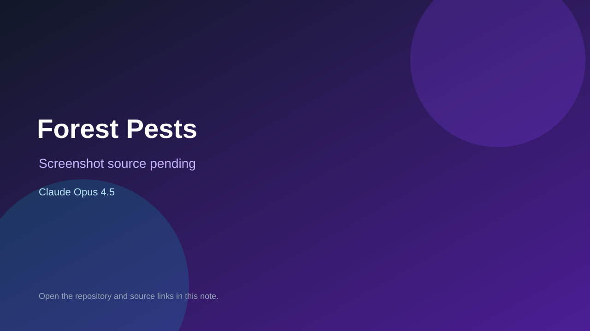

# Forest Pests

> Verified game note.

## At a glance

- **Score:** 7.0/10
- **Model:** Claude Opus 4.5
- **Technology:** TypeScript, Browser
- **Verified:** 2026-09-09
- **Repository:** [https://github.com/fjzeit/forest-pests](https://github.com/fjzeit/forest-pests)
- **Evidence:** [creator-reported model evidence](https://github.com/fjzeit/forest-pests)

## Screenshots

No screenshot source is recorded yet. Keep the placeholder until a repository, awesome list, or creator source provides an image.

## Model attribution

Open the evidence link above. Evidence grade: **creator-reported model evidence**.

## Source description

Repository description and TypeScript source contain a Space Invaders-inspired game written by Claude Opus 4.5.

### Gameplay source

- [https://github.com/fjzeit/forest-pests](https://github.com/fjzeit/forest-pests)

## Verification notes

- **Status:** verified
- **Counted units:** 1
- **Discovery:** https://github.com/fjzeit/forest-pests

[Back to the awesome list](../../README.md)
