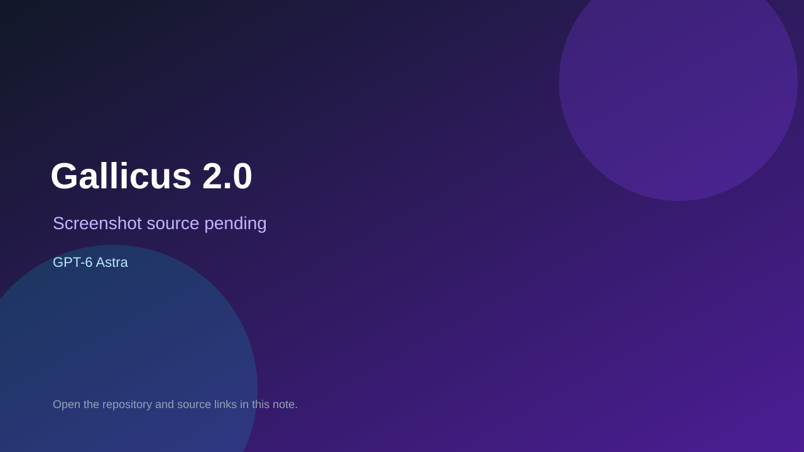

# Gallicus 2.0

> Verified game note.

## At a glance

- **Score:** 8.0/10
- **Model:** GPT-6 Astra
- **Technology:** Godot, GDScript, Forward+, Windows, Steam target
- **Verified:** 2026-09-09
- **Repository:** [https://github.com/Faratas410/Gallicus-2.0](https://github.com/Faratas410/Gallicus-2.0)
- **Evidence:** [creator-reported model evidence](https://github.com/Faratas410/Gallicus-2.0/blob/main/docs/development_workflow.md)

## Screenshots

No screenshot source is recorded yet. Keep the placeholder until a repository, awesome list, or creator source provides an image.

## Model attribution

Open the evidence link above. Evidence grade: **creator-reported model evidence**.

## Source description

The repository contains project.godot, Main and Arena scenes, gameplay systems, audio and visual assets, runtime smoke workflows, and a documented ritual/choice game loop. The development workflow explicitly identifies GPT-6 Astra as the reference model used for implementation. The repository is source-verifiable; final Steam release is a future target.

### Gameplay source

- [https://github.com/Faratas410/Gallicus-2.0/blob/main/docs/development_workflow.md](https://github.com/Faratas410/Gallicus-2.0/blob/main/docs/development_workflow.md)

## Verification notes

- **Status:** verified
- **Counted units:** 1
- **Discovery:** https://github.com/Faratas410/Gallicus-2.0; https://github.com/Faratas410/Gallicus-2.0/blob/main/AGENTS.md

[Back to the awesome list](../../README.md)
