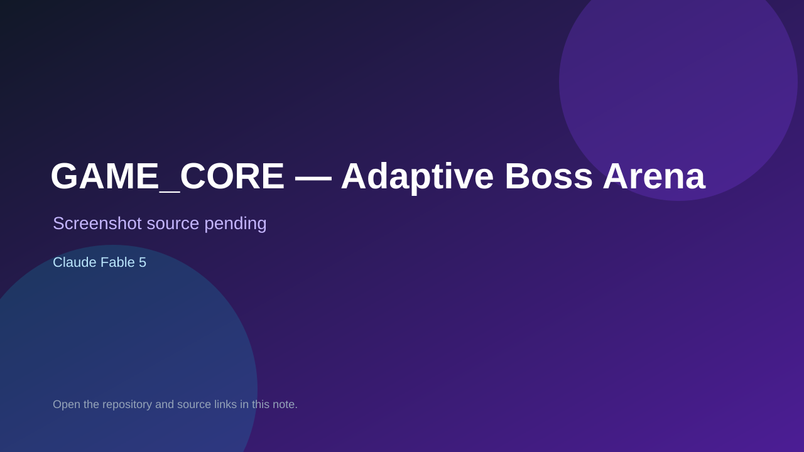

# GAME_CORE — Adaptive Boss Arena

> Verified game note.

## At a glance

- **Score:** 9.3/10
- **Model:** Claude Fable 5
- **Technology:** Unreal Engine 5.8, C++, Python, Native desktop
- **Verified:** 2026-09-10
- **Repository:** [https://github.com/Assassin29092005/GAME_CORE](https://github.com/Assassin29092005/GAME_CORE)
- **Evidence:** [direct model evidence](https://github.com/Assassin29092005/GAME_CORE/commit/ec26751337114d6ef6d8b766f06599df3b3354b1)

## Screenshots

No screenshot source is recorded yet. Keep the placeholder until a repository, awesome list, or creator source provides an image.

## Model attribution

Open the evidence link above. Evidence grade: **direct model evidence**.

## Source description

The public repository is an Unreal Engine 5.8 combat game with a player hero, boss arena, adaptive reinforcement-learning boss AI, combat state, damage, lock-on, minions, overworld, login/telemetry and game-feel systems. The C++ source and Unreal project file are present, Python supplies the RL training and inference bridge, and NEXTSTEP documents the build, cook, smoke and in-world fight checks. The cited commit includes a direct Claude Fable 5 trailer. Count the native boss-arena game as one unit.

### Gameplay source

- [https://github.com/Assassin29092005/GAME_CORE/blob/main/GAME_CORE.uproject](https://github.com/Assassin29092005/GAME_CORE/blob/main/GAME_CORE.uproject)
- [https://github.com/Assassin29092005/GAME_CORE/blob/main/Source/GAME_CORE/Private/CombatComponent.cpp](https://github.com/Assassin29092005/GAME_CORE/blob/main/Source/GAME_CORE/Private/CombatComponent.cpp)
- [https://github.com/Assassin29092005/GAME_CORE/blob/main/Source/GAME_CORE/Private/BossEncounterVolume.cpp](https://github.com/Assassin29092005/GAME_CORE/blob/main/Source/GAME_CORE/Private/BossEncounterVolume.cpp)
- [https://github.com/Assassin29092005/GAME_CORE/blob/main/Source/GAME_CORE/Private/GameFeelSubsystem.cpp](https://github.com/Assassin29092005/GAME_CORE/blob/main/Source/GAME_CORE/Private/GameFeelSubsystem.cpp)
- [https://github.com/Assassin29092005/GAME_CORE/commit/ec26751337114d6ef6d8b766f06599df3b3354b1](https://github.com/Assassin29092005/GAME_CORE/commit/ec26751337114d6ef6d8b766f06599df3b3354b1)

## Verification notes

- **Status:** verified_source
- **Counted units:** 1
- **Discovery:** GitHub code search for Unreal game Co-Authored-By Claude Fable; https://github.com/Assassin29092005/GAME_CORE

[Back to the awesome list](../../README.md)
