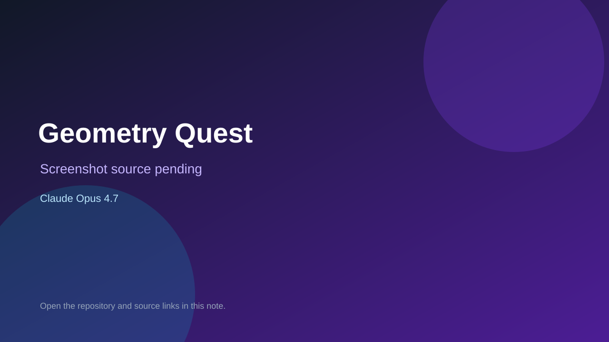

# Geometry Quest

> Verified game note.

## At a glance

- **Score:** 7.8/10
- **Model:** Claude Opus 4.7
- **Technology:** Godot 4.6.2, GDScript, Native
- **Verified:** 2026-09-10
- **Repository:** [https://github.com/sly-the-fox/geometry-quest](https://github.com/sly-the-fox/geometry-quest)
- **Evidence:** [direct model evidence](https://github.com/sly-the-fox/geometry-quest/commit/0097b95e5f40a1c600f4f022e72068385ef355bd)

## Screenshots

No screenshot source is recorded yet. Keep the placeholder until a repository, awesome list, or creator source provides an image.

## Model attribution

Open the evidence link above. Evidence grade: **direct model evidence**.

## Source description

The cited Godot milestone commit identifies a first playable milestone with a Merkaba player character, WASD/gamepad input, a third-person camera and a configured main scene. Follow-up work fixes enemy flash behavior and verifies Godot 4.6.2 headless startup with zero errors. The milestone commits carry direct Co-Authored-By: Claude Opus 4.7 trailers. Count it as a source-verified native game prototype and route it to the non-browser engine section.

### Gameplay source

- [https://github.com/sly-the-fox/geometry-quest/tree/main/scripts](https://github.com/sly-the-fox/geometry-quest/tree/main/scripts)
- [https://github.com/sly-the-fox/geometry-quest/blob/main/project.godot](https://github.com/sly-the-fox/geometry-quest/blob/main/project.godot)
- [https://github.com/sly-the-fox/geometry-quest/commit/0097b95e5f40a1c600f4f022e72068385ef355bd](https://github.com/sly-the-fox/geometry-quest/commit/0097b95e5f40a1c600f4f022e72068385ef355bd)

## Verification notes

- **Status:** verified_source
- **Counted units:** 1
- **Discovery:** GitHub commit search for repo:sly-the-fox/geometry-quest Co-Authored-By Claude Opus 4.6; https://github.com/sly-the-fox/geometry-quest

[Back to the awesome list](../../README.md)
