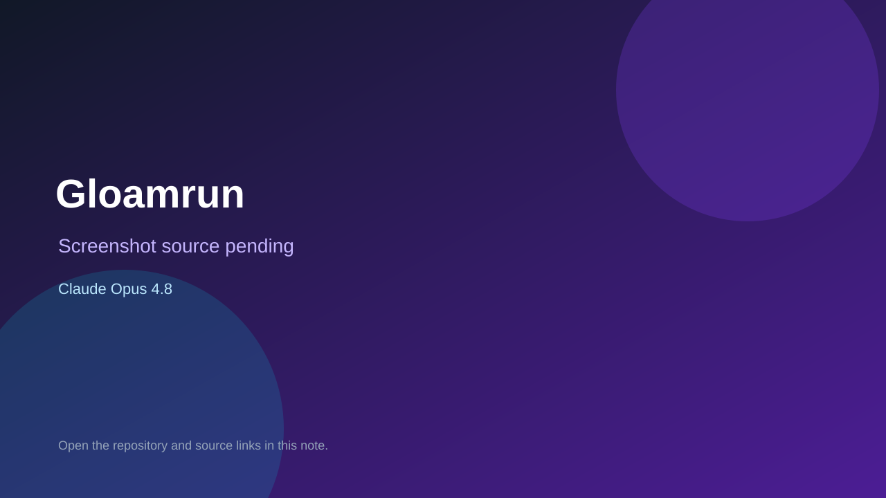

# Gloamrun

> Verified game note.

## At a glance

- **Score:** 9.4/10
- **Model:** Claude Opus 4.8
- **Technology:** TypeScript, Vite, Canvas 2D, WebRTC, Trystero, Procedural audio, Browser multiplayer
- **Verified:** 2026-09-10
- **Repository:** [https://github.com/ben-gy/gloamrun](https://github.com/ben-gy/gloamrun)
- **Evidence:** [direct model evidence](https://github.com/ben-gy/gloamrun/commit/d1fee2534b09c3409ed2f1521041599b72260032)
- **Live demo:** [open demo](https://gloamrun.benrichardson.dev)

## Screenshots

No screenshot source is recorded yet. Keep the placeholder until a repository, awesome list, or creator source provides an image.

## Model attribution

Open the evidence link above. Evidence grade: **direct model evidence**.

## Source description

The README documents Gloamrun as a playable endless co-op dungeon crawl with procedural floors, auto-fire nearest-monster combat, movement, dash invulnerability, upgrade drafting, escalating monster waves, bosses, downed-player revival and 2–4 player peer-to-peer rooms. The source includes the game loop, networked game mode, upgrades, shared fixed-step engine, deterministic RNG, host transfer, rematch and storage. The live GitHub Pages demo is linked, and the repository has tests for balance, P2P synchronization, host election, takeover, rematch and room codes. The cited multiplayer/gameplay systems commit contains an exact Co-authored-by: Claude Opus 4.8 trailer. Count the dungeon game once; exclude shared engine modules.

### Gameplay source

- [https://github.com/ben-gy/gloamrun#readme](https://github.com/ben-gy/gloamrun#readme)
- [https://gloamrun.benrichardson.dev](https://gloamrun.benrichardson.dev)
- [https://github.com/ben-gy/gloamrun/blob/main/src/game.ts](https://github.com/ben-gy/gloamrun/blob/main/src/game.ts)
- [https://github.com/ben-gy/gloamrun/blob/main/src/net-game.ts](https://github.com/ben-gy/gloamrun/blob/main/src/net-game.ts)
- [https://github.com/ben-gy/gloamrun/blob/main/src/upgrades.ts](https://github.com/ben-gy/gloamrun/blob/main/src/upgrades.ts)
- [https://github.com/ben-gy/gloamrun/tree/main/src/engine](https://github.com/ben-gy/gloamrun/tree/main/src/engine)
- [https://github.com/ben-gy/gloamrun/tree/main/tests](https://github.com/ben-gy/gloamrun/tree/main/tests)
- [https://github.com/ben-gy/gloamrun/commit/d1fee2534b09c3409ed2f1521041599b72260032](https://github.com/ben-gy/gloamrun/commit/d1fee2534b09c3409ed2f1521041599b72260032)

## Verification notes

- **Status:** verified_source
- **Counted units:** 1
- **Discovery:** Reverse-link from ben-gy/gh-game-factory index; GitHub commit search for Co-Authored-By Claude Opus game; https://github.com/ben-gy/gloamrun

[Back to the awesome list](../../README.md)
