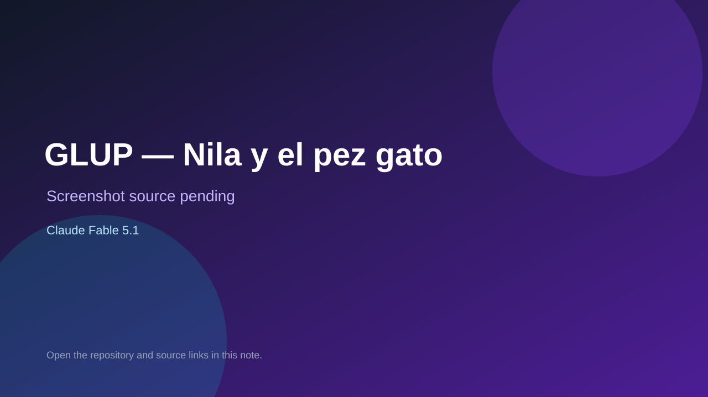

# GLUP — Nila y el pez gato

> Verified game note.

## At a glance

- **Score:** 8.9/10
- **Model:** Claude Fable 5.1
- **Technology:** HTML, JavaScript, Canvas 2D, Web Audio API, PWA, Browser
- **Verified:** 2026-09-10
- **Repository:** [https://github.com/gavilanbe/glup](https://github.com/gavilanbe/glup)
- **Evidence:** [direct model evidence](https://github.com/gavilanbe/glup#las-habilidades-de-bigotes)
- **Live demo:** [open demo](https://gavilanbe.github.io/glup/)

## Screenshots

No screenshot source is recorded yet. Keep the placeholder until a repository, awesome list, or creator source provides an image.

## Model attribution

Open the evidence link above. Evidence grade: **direct model evidence**.

## Source description

The README links a live PWA and documents a complete 2D pixel-platformer with four themed levels, checkpoints, collectible abilities, suction and projectile combat, destructible terrain, moving platforms, hazards, health, a heron boss, level summaries, progress and saved best times. It contains source files for physics, input, enemies, levels, audio and UI and explicitly credits Claude Fable 5.1.

### Gameplay source

- [https://github.com/gavilanbe/glup](https://github.com/gavilanbe/glup)
- [https://gavilanbe.github.io/glup/](https://gavilanbe.github.io/glup/)
- [https://github.com/gavilanbe/glup#las-habilidades-de-bigotes](https://github.com/gavilanbe/glup#las-habilidades-de-bigotes)

## Verification notes

- **Status:** verified_source_and_live_demo
- **Counted units:** 1
- **Discovery:** GitHub repository search: Claude Fable 5.1 game in:readme pushed:2026-09-09..2026-09-10; https://github.com/gavilanbe/glup

[Back to the awesome list](../../README.md)
