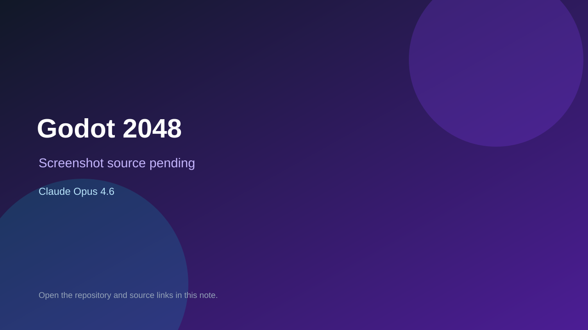

# Godot 2048

> Verified game note.

## At a glance

- **Score:** 7.5/10
- **Model:** Claude Opus 4.6
- **Technology:** Godot, GDScript, Native desktop
- **Verified:** 2026-09-10
- **Repository:** [https://github.com/daiSky88/godot-2048](https://github.com/daiSky88/godot-2048)
- **Evidence:** [direct model evidence](https://github.com/daiSky88/godot-2048/commit/3f3e4d9ce92182fed51f17d5c51132ecdc891036)

## Screenshots

No screenshot source is recorded yet. Keep the placeholder until a repository, awesome list, or creator source provides an image.

## Model attribution

Open the evidence link above. Evidence grade: **direct model evidence**.

## Source description

The initial commit identifies a Godot 2048 game and includes project.godot, a main scene, game-over and win dialogs, a 4x4 GridBoard, tile logic, score display, game state manager and save manager. The repository README documents the 2048 merge/spawn game structure. The initial commit includes a direct Claude Opus 4.6 trailer.

### Gameplay source

- [https://github.com/daiSky88/godot-2048/blob/3f3e4d9ce92182fed51f17d5c51132ecdc891036/project.godot](https://github.com/daiSky88/godot-2048/blob/3f3e4d9ce92182fed51f17d5c51132ecdc891036/project.godot)
- [https://github.com/daiSky88/godot-2048/blob/3f3e4d9ce92182fed51f17d5c51132ecdc891036/scripts/components/GridBoard.gd](https://github.com/daiSky88/godot-2048/blob/3f3e4d9ce92182fed51f17d5c51132ecdc891036/scripts/components/GridBoard.gd)
- [https://github.com/daiSky88/godot-2048/blob/3f3e4d9ce92182fed51f17d5c51132ecdc891036/scripts/components/Tile.gd](https://github.com/daiSky88/godot-2048/blob/3f3e4d9ce92182fed51f17d5c51132ecdc891036/scripts/components/Tile.gd)
- [https://github.com/daiSky88/godot-2048/blob/3f3e4d9ce92182fed51f17d5c51132ecdc891036/scenes/main/Main.tscn](https://github.com/daiSky88/godot-2048/blob/3f3e4d9ce92182fed51f17d5c51132ecdc891036/scenes/main/Main.tscn)
- [https://github.com/daiSky88/godot-2048/commit/3f3e4d9ce92182fed51f17d5c51132ecdc891036](https://github.com/daiSky88/godot-2048/commit/3f3e4d9ce92182fed51f17d5c51132ecdc891036)

## Verification notes

- **Status:** verified_source
- **Counted units:** 1
- **Discovery:** GitHub commit search for Godot game Co-Authored-By Claude Opus; https://github.com/daiSky88/godot-2048

[Back to the awesome list](../../README.md)
