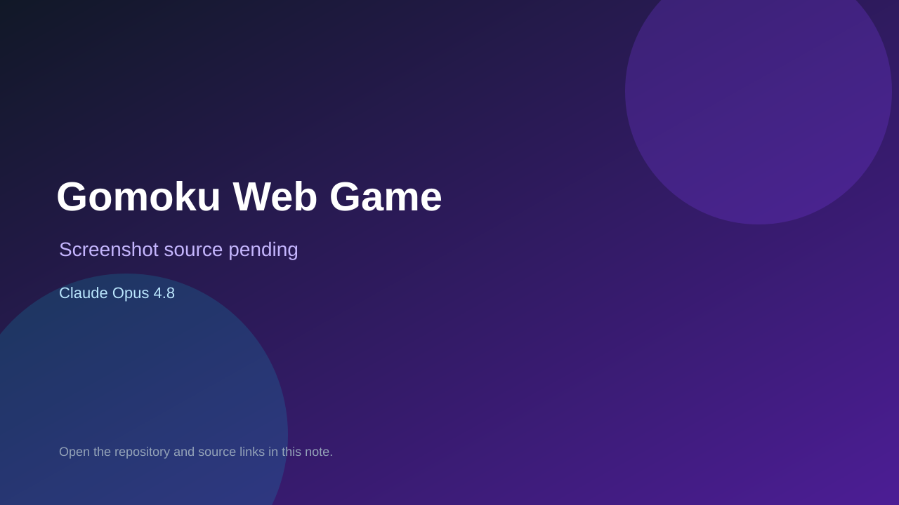

# Gomoku Web Game

> Verified game note.

## At a glance

- **Score:** 8.7/10
- **Model:** Claude Opus 4.8
- **Technology:** React 19, TypeScript, Vite, Socket.IO, Web Audio API, Browser
- **Verified:** 2026-09-10
- **Repository:** [https://github.com/gww1981/gomoku-game](https://github.com/gww1981/gomoku-game)
- **Evidence:** [direct model evidence](https://github.com/gww1981/gomoku-game/commit/b3f2a891d1c434c32e4af28c09b327f51c2495e5)

## Screenshots

No screenshot source is recorded yet. Keep the placeholder until a repository, awesome list, or creator source provides an image.

## Model attribution

Open the evidence link above. Evidence grade: **direct model evidence**.

## Source description

The README describes a complete Gomoku game with 15x15 board play, local two-player mode, three AI levels, LAN multiplayer, undo, timeout loss, replay playback, audio and persistent records. Game.tsx and Board.tsx provide the UI, gameLogic.ts implements win detection and state rules, and replayEngine.ts implements recorded matches. The cited commit includes an exact Co-Authored-By: Claude Opus 4.8 trailer. No public live demo URL was found.

### Gameplay source

- [https://github.com/gww1981/gomoku-game/blob/b3f2a891d1c434c32e4af28c09b327f51c2495e5/src/components/Game.tsx](https://github.com/gww1981/gomoku-game/blob/b3f2a891d1c434c32e4af28c09b327f51c2495e5/src/components/Game.tsx)
- [https://github.com/gww1981/gomoku-game/blob/b3f2a891d1c434c32e4af28c09b327f51c2495e5/src/components/Board.tsx](https://github.com/gww1981/gomoku-game/blob/b3f2a891d1c434c32e4af28c09b327f51c2495e5/src/components/Board.tsx)
- [https://github.com/gww1981/gomoku-game/blob/b3f2a891d1c434c32e4af28c09b327f51c2495e5/src/game/gameLogic.ts](https://github.com/gww1981/gomoku-game/blob/b3f2a891d1c434c32e4af28c09b327f51c2495e5/src/game/gameLogic.ts)
- [https://github.com/gww1981/gomoku-game/blob/b3f2a891d1c434c32e4af28c09b327f51c2495e5/src/replay/replayEngine.ts](https://github.com/gww1981/gomoku-game/blob/b3f2a891d1c434c32e4af28c09b327f51c2495e5/src/replay/replayEngine.ts)
- [https://github.com/gww1981/gomoku-game/commit/b3f2a891d1c434c32e4af28c09b327f51c2495e5](https://github.com/gww1981/gomoku-game/commit/b3f2a891d1c434c32e4af28c09b327f51c2495e5)

## Verification notes

- **Status:** verified_source
- **Counted units:** 1
- **Discovery:** GitHub code search for C++ game Co-Authored-By Claude Opus; https://github.com/gww1981/gomoku-game

[Back to the awesome list](../../README.md)
