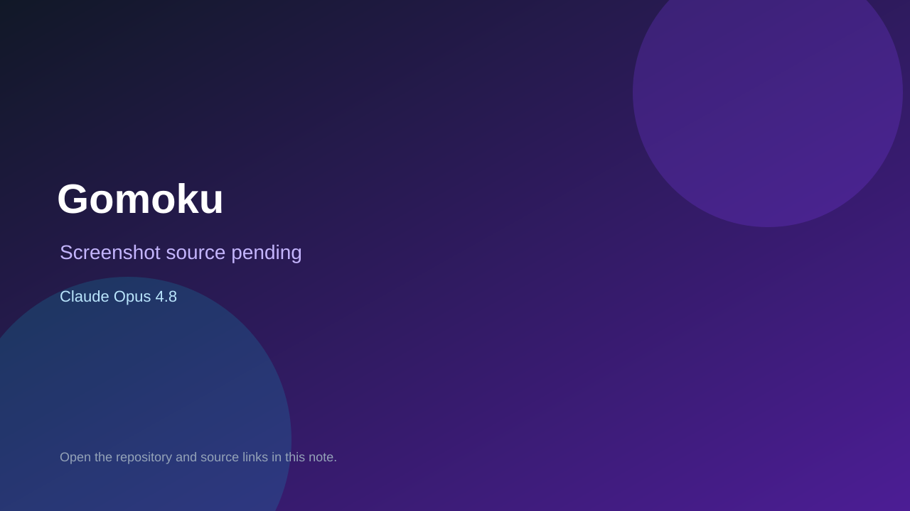

# Gomoku

> Verified game note.

## At a glance

- **Score:** 7.9/10
- **Model:** Claude Opus 4.8
- **Technology:** Pygame, Python, Native desktop
- **Verified:** 2026-09-10
- **Repository:** [https://github.com/wshen-ai/game-wuzi](https://github.com/wshen-ai/game-wuzi)
- **Evidence:** [direct model evidence](https://github.com/wshen-ai/game-wuzi/commit/e0992df90d41729650a73dc1a152a0d3ee79af19)

## Screenshots

No screenshot source is recorded yet. Keep the placeholder until a repository, awesome list, or creator source provides an image.

## Model attribution

Open the evidence link above. Evidence grade: **direct model evidence**.

## Source description

The initial commit is titled Gomoku game with pygame and contains a 15x15 board, win detection, AI, renderer, UI and main entrypoint. The commit page shows a direct Claude Opus 4.8 trailer.

### Gameplay source

- [https://github.com/wshen-ai/game-wuzi/blob/master/main.py](https://github.com/wshen-ai/game-wuzi/blob/master/main.py)
- [https://github.com/wshen-ai/game-wuzi/blob/master/board.py](https://github.com/wshen-ai/game-wuzi/blob/master/board.py)
- [https://github.com/wshen-ai/game-wuzi/blob/master/ai.py](https://github.com/wshen-ai/game-wuzi/blob/master/ai.py)
- [https://github.com/wshen-ai/game-wuzi/commit/e0992df90d41729650a73dc1a152a0d3ee79af19](https://github.com/wshen-ai/game-wuzi/commit/e0992df90d41729650a73dc1a152a0d3ee79af19)

## Verification notes

- **Status:** verified_source
- **Counted units:** 1
- **Discovery:** GitHub commit search for Pygame game Co-Authored-By Claude Opus; https://github.com/wshen-ai/game-wuzi

[Back to the awesome list](../../README.md)
