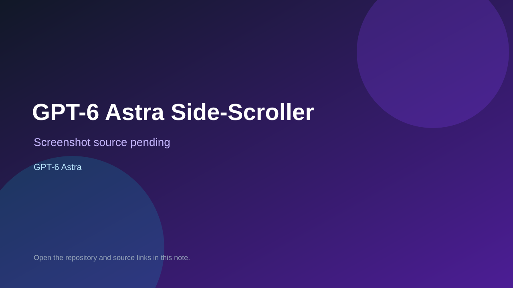

# GPT-6 Astra Side-Scroller

> Verified game note.

## At a glance

- **Score:** 7.2/10
- **Model:** GPT-6 Astra
- **Technology:** HTML, JavaScript, Canvas 2D, Browser
- **Verified:** 2026-09-10
- **Repository:** [https://github.com/NeoAiLabs/sidescroller](https://github.com/NeoAiLabs/sidescroller)
- **Evidence:** [direct model evidence](https://github.com/NeoAiLabs/sidescroller#results)

## Screenshots

No screenshot source is recorded yet. Keep the placeholder until a repository, awesome list, or creator source provides an image.

## Model attribution

Open the evidence link above. Evidence grade: **direct model evidence**.

## Source description

The README identifies GPT-6 Astra as one of the one-shot model results and provides a direct gpt-6-astra.html artifact. It documents the required platforming, enemies, collectibles, checkpoints, cyber-lobster boss, win and game-over states, and direct-file play without a build step. The repository is a benchmark, but this result is an actual self-contained game artifact, not a prompt-only entry. No hosted demo was supplied.

### Gameplay source

- [https://github.com/NeoAiLabs/sidescroller/blob/main/gpt-6-astra.html](https://github.com/NeoAiLabs/sidescroller/blob/main/gpt-6-astra.html)
- [https://github.com/NeoAiLabs/sidescroller#results](https://github.com/NeoAiLabs/sidescroller#results)

## Verification notes

- **Status:** verified_source_live_unavailable
- **Counted units:** 1
- **Discovery:** https://api.github.com/search/repositories?q=%22GPT-6+Astra%22+playable+game+in%3Areadme; https://github.com/NeoAiLabs/sidescroller

[Back to the awesome list](../../README.md)
