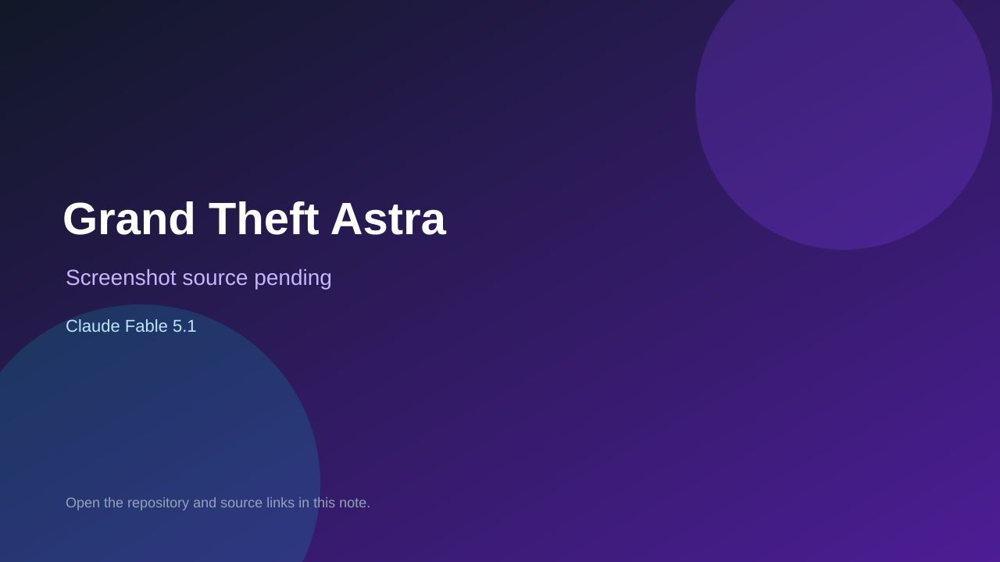

# Grand Theft Astra

> Top-list entry: **today** (#5), **this week** (#7), **this month** (#7).

## At a glance

- **Score:** 9.5/10
- **Model:** Claude Fable 5.1
- **Technology:** TypeScript, React, React Three Fiber, WebGL, Cloudflare Workers, Browser multiplayer
- **Verified:** 2026-09-12
- **Repository:** [https://github.com/angelaborowski/grand-theft-astra](https://github.com/angelaborowski/grand-theft-astra)
- **Evidence:** [direct model evidence](https://github.com/angelaborowski/grand-theft-astra/commit/c5e718d48430f9bd97e006c7bacd6d7eeb45ef7)

## Screenshots

No screenshot source is recorded yet. Keep the placeholder until a repository, awesome list, or creator source provides an image.

## Model attribution

Open the evidence link above. Evidence grade: **direct model evidence**.

## Source description

The README describes a multiplayer browser-game prototype set in a 3D Red Square. It documents third-person movement, running, jumping, crouching, vehicles, helicopter controls, combat/equipment, missions, shelter and parcel-delivery journeys, persistent progress, server-validated actions, multiplayer world updates, assets and tests. The web source contains the game session, player and vehicle controllers, mission panels, world entities, stunt course, inventory, map and conversation systems; the shared core contains gameplay rules and tests. A player-facing movement commit contains an exact Co-Authored-By: Claude Fable 5.1 trailer, and the repository also has Fable-attributed conversation work. The inferred Vercel/Pages URLs were not reachable during verification, so no live demo is claimed.

### Gameplay source

- [https://github.com/angelaborowski/grand-theft-astra#readme](https://github.com/angelaborowski/grand-theft-astra#readme)
- [https://github.com/angelaborowski/grand-theft-astra/tree/main/apps/web/src/features/game](https://github.com/angelaborowski/grand-theft-astra/tree/main/apps/web/src/features/game)
- [https://github.com/angelaborowski/grand-theft-astra/blob/main/apps/web/src/features/game/components/game.tsx](https://github.com/angelaborowski/grand-theft-astra/blob/main/apps/web/src/features/game/components/game.tsx)
- [https://github.com/angelaborowski/grand-theft-astra/blob/main/apps/web/src/features/game/components/stunt-course.tsx](https://github.com/angelaborowski/grand-theft-astra/blob/main/apps/web/src/features/game/components/stunt-course.tsx)
- [https://github.com/angelaborowski/grand-theft-astra/blob/main/packages/core/src/gameplay-v2.ts](https://github.com/angelaborowski/grand-theft-astra/blob/main/packages/core/src/gameplay-v2.ts)
- [https://github.com/angelaborowski/grand-theft-astra/tree/main/apps/server/tests](https://github.com/angelaborowski/grand-theft-astra/tree/main/apps/server/tests)
- [https://github.com/angelaborowski/grand-theft-astra/commit/c5e718d48430f9bd97e006c7bacd6d7eeb45ef7](https://github.com/angelaborowski/grand-theft-astra/commit/c5e718d48430f9bd97e006c7bacd6d7eeb45ef7)

## Verification notes

- **Status:** verified_source
- **Counted units:** 1
- **Discovery:** GitHub commit search for game Astra/Fable, 2026-09-10..2026-09-12; https://github.com/angelaborowski/grand-theft-astra

[Back to the awesome list](../../README.md)
