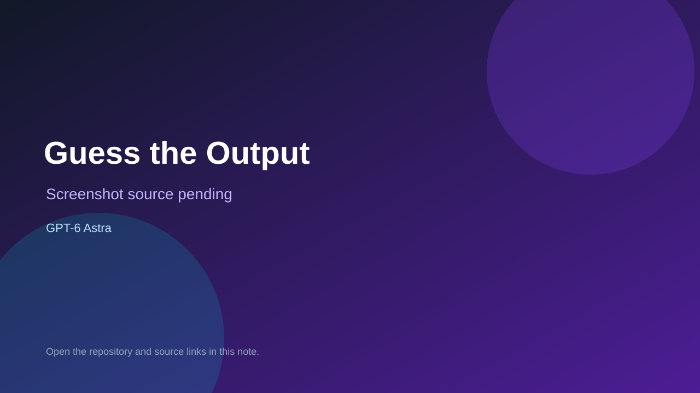

# Guess the Output

> Verified game note.

## At a glance

- **Score:** 9.0/10
- **Model:** GPT-6 Astra
- **Technology:** JavaScript, React, Express, Socket.IO, WebSocket, Browser
- **Verified:** 2026-09-12
- **Repository:** [https://github.com/HaarisahHussain/Spin-The-Wheel-](https://github.com/HaarisahHussain/Spin-The-Wheel-)
- **Evidence:** [creator-reported model evidence](https://github.com/HaarisahHussain/Spin-The-Wheel-/commit/524f72ec3757e5993e09a10649b60f064a2b8eac)

## Screenshots

No screenshot source is recorded yet. Keep the placeholder until a repository, awesome list, or creator source provides an image.

## Model attribution

Open the evidence link above. Evidence grade: **creator-reported model evidence**.

## Source description

The README identifies this as a React/Express/Socket.IO arcade for public displays, student phones and a host. It names three game modes: Debug Dash, Guess the Output and Robot Rescue. The registry provides separate adapters; quiz.js generates and scores the two code challenges, robot.js generates blocked-grid boards and evaluates movement programs, and Game.jsx provides separate player/display interfaces. The README and tests document solo and live multiplayer, timed rounds, scores, queues, host controls and end-to-end checks. The September 11 feature commit credits GPT-6 Astra (Medium). The inferred deployment URLs returned HTTP 404 during verification, so no live demo is claimed. Count the three game modes; exclude the shared event, queue, host and wheel systems.

### Gameplay source

- [https://github.com/HaarisahHussain/Spin-The-Wheel-#readme](https://github.com/HaarisahHussain/Spin-The-Wheel-#readme)
- [https://github.com/HaarisahHussain/Spin-The-Wheel-/blob/main/server/games/registry.js](https://github.com/HaarisahHussain/Spin-The-Wheel-/blob/main/server/games/registry.js)
- [https://github.com/HaarisahHussain/Spin-The-Wheel-/blob/main/server/games/quiz.js](https://github.com/HaarisahHussain/Spin-The-Wheel-/blob/main/server/games/quiz.js)
- [https://github.com/HaarisahHussain/Spin-The-Wheel-/blob/main/server/games/robot.js](https://github.com/HaarisahHussain/Spin-The-Wheel-/blob/main/server/games/robot.js)
- [https://github.com/HaarisahHussain/Spin-The-Wheel-/blob/main/src/games/Game.jsx](https://github.com/HaarisahHussain/Spin-The-Wheel-/blob/main/src/games/Game.jsx)
- [https://github.com/HaarisahHussain/Spin-The-Wheel-/tree/main/tests](https://github.com/HaarisahHussain/Spin-The-Wheel-/tree/main/tests)
- [https://github.com/HaarisahHussain/Spin-The-Wheel-/commit/524f72ec3757e5993e09a10649b60f064a2b8eac](https://github.com/HaarisahHussain/Spin-The-Wheel-/commit/524f72ec3757e5993e09a10649b60f064a2b8eac)

## Verification notes

- **Status:** verified_source
- **Counted units:** 3
- **Discovery:** GitHub commit search for game GPT-6 Astra, 2026-09-10..2026-09-12; https://github.com/HaarisahHussain/Spin-The-Wheel-

[Back to the awesome list](../../README.md)
