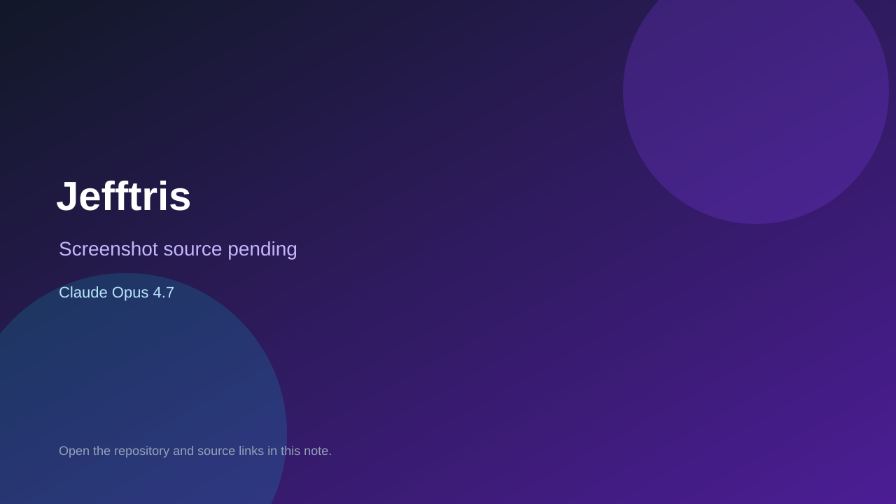

# Jefftris

> Verified game note.

## At a glance

- **Score:** 8.7/10
- **Model:** Claude Opus 4.7
- **Technology:** libGDX, Java, Native desktop
- **Verified:** 2026-09-10
- **Repository:** [https://github.com/jabernathy/jefftris](https://github.com/jabernathy/jefftris)
- **Evidence:** [direct model evidence](https://github.com/jabernathy/jefftris/commit/aeb5f5af01b1f711db3bb3e4c81b13ba6399c6fc)

## Screenshots

No screenshot source is recorded yet. Keep the placeholder until a repository, awesome list, or creator source provides an image.

## Model attribution

Open the evidence link above. Evidence grade: **direct model evidence**.

## Source description

The initial commit is titled Jefftris libgdx Tetris clone. Its source includes title/game/high-score screens, game engine, gravity, piece spawning, scoring, board/cell/game-state models, tetromino types, renderer, desktop launcher and unit tests. The commit page shows a direct Claude Opus 4.7 trailer.

### Gameplay source

- [https://github.com/jabernathy/jefftris/tree/main/src/main/java/com/jefftris](https://github.com/jabernathy/jefftris/tree/main/src/main/java/com/jefftris)
- [https://github.com/jabernathy/jefftris/blob/main/src/main/java/com/jefftris/screen/GameScreen.java](https://github.com/jabernathy/jefftris/blob/main/src/main/java/com/jefftris/screen/GameScreen.java)
- [https://github.com/jabernathy/jefftris/commit/aeb5f5af01b1f711db3bb3e4c81b13ba6399c6fc](https://github.com/jabernathy/jefftris/commit/aeb5f5af01b1f711db3bb3e4c81b13ba6399c6fc)

## Verification notes

- **Status:** verified_source
- **Counted units:** 1
- **Discovery:** GitHub commit search for LibGDX game Co-Authored-By Claude Opus; https://github.com/jabernathy/jefftris

[Back to the awesome list](../../README.md)
