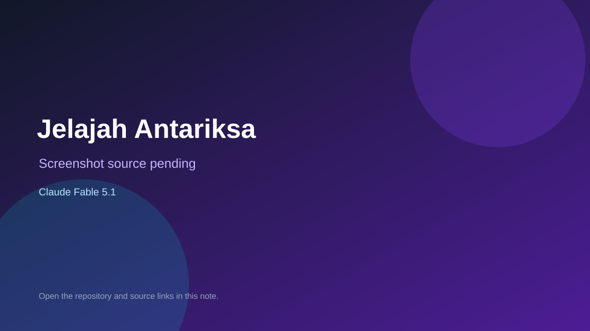

# Jelajah Antariksa

> Verified game note.

## At a glance

- **Score:** 7.0/10
- **Model:** Claude Fable 5.1
- **Technology:** HTML, JavaScript, Three.js
- **Verified:** 2026-09-09
- **Repository:** [https://github.com/RafiulM/3d-game-fable5.1](https://github.com/RafiulM/3d-game-fable5.1)
- **Evidence:** [creator-reported model evidence](https://github.com/RafiulM/3d-game-fable5.1/blob/main/README.md)

## Screenshots

No screenshot source is recorded yet. Keep the placeholder until a repository, awesome list, or creator source provides an image.

## Model attribution

Open the evidence link above. Evidence grade: **creator-reported model evidence**.

## Source description

README and Three.js source contain a playable browser 3D space-exploration game; repository description identifies Fable 5.1.

### Gameplay source

- [https://github.com/RafiulM/3d-game-fable5.1/blob/main/README.md](https://github.com/RafiulM/3d-game-fable5.1/blob/main/README.md)

## Verification notes

- **Status:** verified
- **Counted units:** 1
- **Discovery:** https://github.com/RafiulM/3d-game-fable5.1

[Back to the awesome list](../../README.md)
