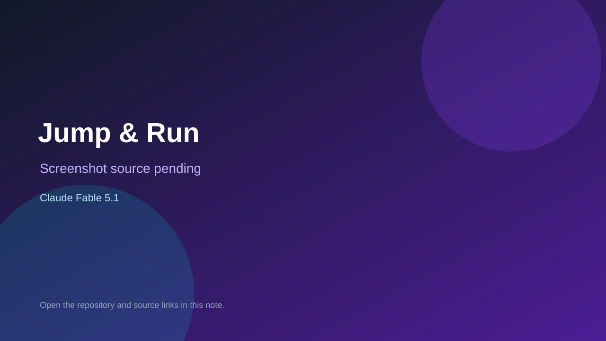

# Jump & Run

> Verified game note.

## At a glance

- **Score:** 9.5/10
- **Model:** Claude Fable 5.1
- **Technology:** HTML, JavaScript, Canvas 2D, Web Audio, Browser/iPad
- **Verified:** 2026-09-12
- **Repository:** [https://github.com/gberry747-lab/gabriels-animation-studio](https://github.com/gberry747-lab/gabriels-animation-studio)
- **Evidence:** [direct model evidence](https://github.com/gberry747-lab/gabriels-animation-studio/commit/f3e68b8fc0165f1cbace50f6204a83192a5ceb79)
- **Live demo:** [open demo](https://gberry747-lab.github.io/gabriels-animation-studio/)

## Screenshots

No screenshot source is recorded yet. Keep the placeholder until a repository, awesome list, or creator source provides an image.

## Model attribution

Open the evidence link above. Evidence grade: **direct model evidence**.

## Source description

The README documents a single-file browser/iPad game where the player draws a stick figure and plays eight mini-games. index.html contains separate controls and labels for Jump & Run, Endless Dash, Star Catch, Sky Flap, Bubble Pop, Meteor Dodge, Cloud Bounce and Goal Kick. The source implements separate game initialization, targets and update rules: stars, obstacles, enemies, platforms, gaps, bubbles, meteors, cloud height and scored goals. It includes hearts, score state, restart/results, pointer and keyboard controls, Canvas rendering, audio feedback and local best-score persistence. The GitHub Pages URL is documented as the play link. The cited initial gameplay commit contains an exact Co-Authored-By: Claude Fable 5.1 trailer. Count the eight independently playable mini-games; exclude the drawing editor and shared avatar system.

### Gameplay source

- [https://github.com/gberry747-lab/gabriels-animation-studio#readme](https://github.com/gberry747-lab/gabriels-animation-studio#readme)
- [https://gberry747-lab.github.io/gabriels-animation-studio/](https://gberry747-lab.github.io/gabriels-animation-studio/)
- [https://github.com/gberry747-lab/gabriels-animation-studio/blob/main/index.html](https://github.com/gberry747-lab/gabriels-animation-studio/blob/main/index.html)
- [https://github.com/gberry747-lab/gabriels-animation-studio/blob/main/START-HERE.md](https://github.com/gberry747-lab/gabriels-animation-studio/blob/main/START-HERE.md)
- [https://github.com/gberry747-lab/gabriels-animation-studio/commit/f3e68b8fc0165f1cbace50f6204a83192a5ceb79](https://github.com/gberry747-lab/gabriels-animation-studio/commit/f3e68b8fc0165f1cbace50f6204a83192a5ceb79)

## Verification notes

- **Status:** verified_source
- **Counted units:** 8
- **Discovery:** GitHub commit search for game Co-Authored-By Claude Fable, 2026-09-10..2026-09-12; https://github.com/gberry747-lab/gabriels-animation-studio

[Back to the awesome list](../../README.md)
