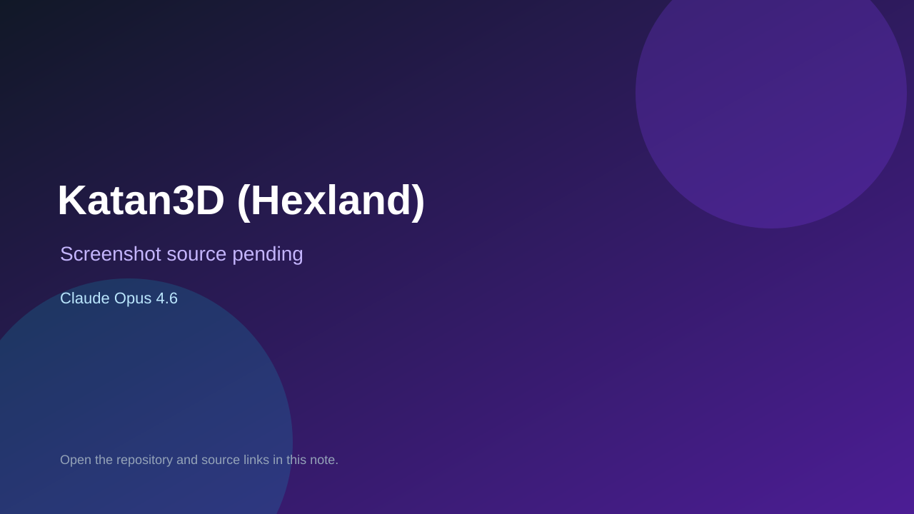

# Katan3D (Hexland)

> Verified game note.

## At a glance

- **Score:** 8.7/10
- **Model:** Claude Opus 4.6
- **Technology:** Unity 6, C#, 3D, Native
- **Verified:** 2026-09-10
- **Repository:** [https://github.com/kimotomura-0101/hexland](https://github.com/kimotomura-0101/hexland)
- **Evidence:** [direct model evidence](https://github.com/kimotomura-0101/hexland/commit/e0ca560a8aacfd33986cee01be7fffdeaacb5f8e)

## Screenshots

No screenshot source is recorded yet. Keep the placeholder until a repository, awesome list, or creator source provides an image.

## Model attribution

Open the evidence link above. Evidence grade: **direct model evidence**.

## Source description

The initial commit is titled Katan3D (Hexland) project and describes a Unity 6 Catan-style 3D board game with AI opponents and exploration. The project contains Unity scenes, board/building/tile assets and game source. The commit page shows a direct Co-Authored-By: Claude Opus 4.6 trailer.

### Gameplay source

- [https://github.com/kimotomura-0101/hexland/tree/main/Assets](https://github.com/kimotomura-0101/hexland/tree/main/Assets)
- [https://github.com/kimotomura-0101/hexland/tree/main/Assets/Scenes](https://github.com/kimotomura-0101/hexland/tree/main/Assets/Scenes)
- [https://github.com/kimotomura-0101/hexland/commit/e0ca560a8aacfd33986cee01be7fffdeaacb5f8e](https://github.com/kimotomura-0101/hexland/commit/e0ca560a8aacfd33986cee01be7fffdeaacb5f8e)

## Verification notes

- **Status:** verified_source
- **Counted units:** 1
- **Discovery:** GitHub commit search for Unity game Co-Authored-By Claude Opus 4.6; https://github.com/kimotomura-0101/hexland

[Back to the awesome list](../../README.md)
