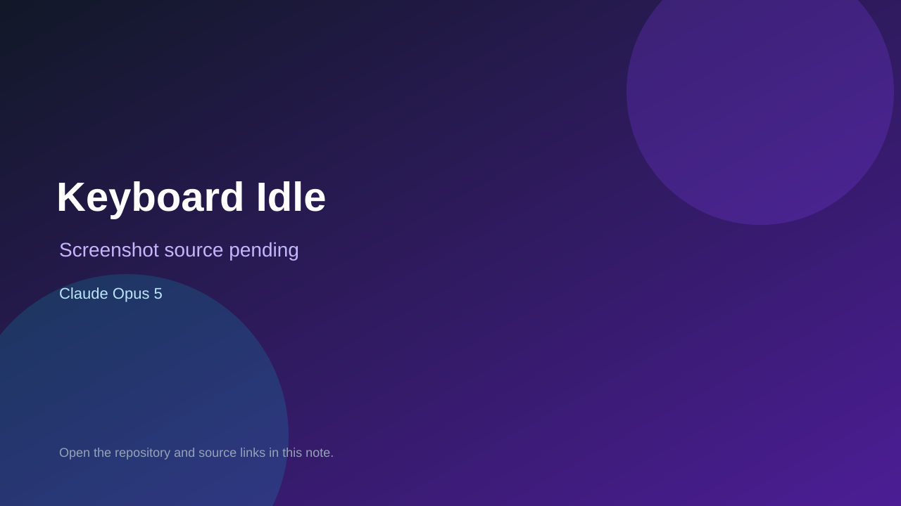

# Keyboard Idle

> Verified game note.

## At a glance

- **Score:** 8.5/10
- **Model:** Claude Opus 5
- **Technology:** Godot, GDScript, Native desktop
- **Verified:** 2026-09-10
- **Repository:** [https://github.com/enricosaito/keyboard-idle](https://github.com/enricosaito/keyboard-idle)
- **Evidence:** [direct model evidence](https://github.com/enricosaito/keyboard-idle/commit/6edbfb6fe83e7b75bed4e5305fbdece93b1a5338)

## Screenshots

No screenshot source is recorded yet. Keep the placeholder until a repository, awesome list, or creator source provides an image.

## Model attribution

Open the evidence link above. Evidence grade: **direct model evidence**.

## Source description

The README identifies Keyboard Idle as a Godot 4 incremental game targeting Steam and gives run instructions. The repository contains the main scene, autoload game state/save systems, simulation rules, typing input, upgrade catalogue and UI tabs. The initial commit includes a direct Claude Opus 5 trailer and a Claude session link.

### Gameplay source

- [https://github.com/enricosaito/keyboard-idle/blob/6edbfb6fe83e7b75bed4e5305fbdece93b1a5338/project.godot](https://github.com/enricosaito/keyboard-idle/blob/6edbfb6fe83e7b75bed4e5305fbdece93b1a5338/project.godot)
- [https://github.com/enricosaito/keyboard-idle/blob/6edbfb6fe83e7b75bed4e5305fbdece93b1a5338/src/core/simulation.gd](https://github.com/enricosaito/keyboard-idle/blob/6edbfb6fe83e7b75bed4e5305fbdece93b1a5338/src/core/simulation.gd)
- [https://github.com/enricosaito/keyboard-idle/blob/6edbfb6fe83e7b75bed4e5305fbdece93b1a5338/src/ui/main_ui.gd](https://github.com/enricosaito/keyboard-idle/blob/6edbfb6fe83e7b75bed4e5305fbdece93b1a5338/src/ui/main_ui.gd)
- [https://github.com/enricosaito/keyboard-idle/commit/6edbfb6fe83e7b75bed4e5305fbdece93b1a5338](https://github.com/enricosaito/keyboard-idle/commit/6edbfb6fe83e7b75bed4e5305fbdece93b1a5338)

## Verification notes

- **Status:** verified_source
- **Counted units:** 1
- **Discovery:** GitHub commit search for Godot game Co-Authored-By Claude Opus; https://github.com/enricosaito/keyboard-idle

[Back to the awesome list](../../README.md)
