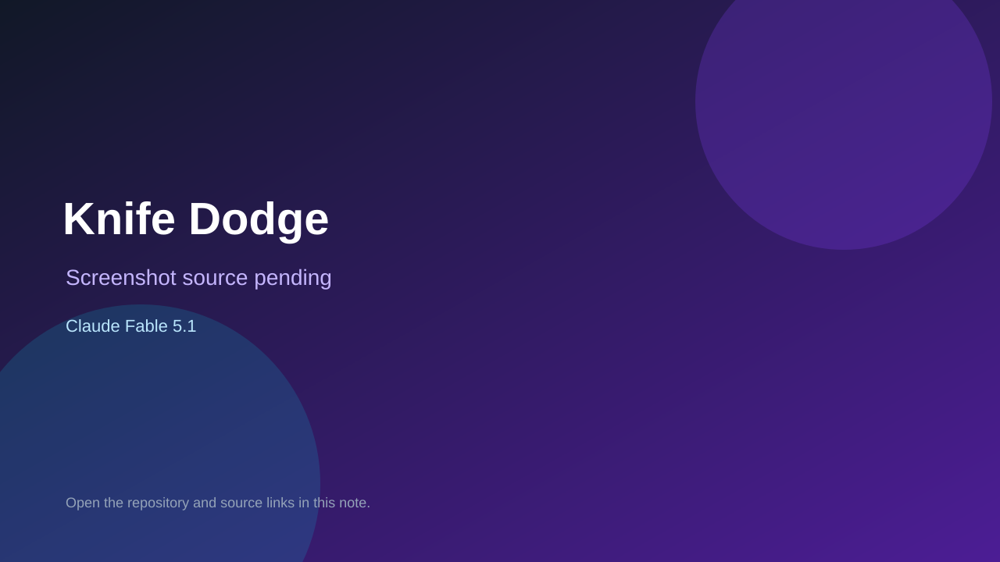

# Knife Dodge

> Top-list entry: **this week** (#9), **this month** (#9).

## At a glance

- **Score:** 9.5/10
- **Model:** Claude Fable 5.1
- **Technology:** Godot, GDScript, Native iOS, Native iPadOS
- **Verified:** 2026-09-10
- **Repository:** [https://github.com/Karanvir1729/ninja-knife-dodge](https://github.com/Karanvir1729/ninja-knife-dodge)
- **Evidence:** [direct model evidence](https://github.com/Karanvir1729/ninja-knife-dodge/commit/0283ea60e91257905f1fc93ff4e1a548db3be078)

## Screenshots

No screenshot source is recorded yet. Keep the placeholder until a repository, awesome list, or creator source provides an image.

## Model attribution

Open the evidence link above. Evidence grade: **direct model evidence**.

## Source description

The README documents a Godot 4 offline mobile arcade with four story trials: Knife Dodge, Shuriken Match, Sensei Says and Quick Draw. It also documents the Yard's fifth arcade game, Star Cricket. The repository contains separate state scenes and gameplay scripts for all five games, shared hub/menu/results/save systems, a Godot project configuration, iOS export support, smoke tests and native build instructions. The cited merge commit explicitly says it merges all four games and includes a direct Claude Fable 5.1 trailer; the later Star Cricket commit also carries Fable 5.1 evidence. Count the four trials and Star Cricket, but do not count the Loop Room music toy as another game.

### Gameplay source

- [https://github.com/Karanvir1729/ninja-knife-dodge/blob/0283ea60e91257905f1fc93ff4e1a548db3be078/project.godot](https://github.com/Karanvir1729/ninja-knife-dodge/blob/0283ea60e91257905f1fc93ff4e1a548db3be078/project.godot)
- [https://github.com/Karanvir1729/ninja-knife-dodge/blob/main/States/play_state.gd](https://github.com/Karanvir1729/ninja-knife-dodge/blob/main/States/play_state.gd)
- [https://github.com/Karanvir1729/ninja-knife-dodge/blob/main/States/match_play_state.gd](https://github.com/Karanvir1729/ninja-knife-dodge/blob/main/States/match_play_state.gd)
- [https://github.com/Karanvir1729/ninja-knife-dodge/blob/main/States/simon_play_state.gd](https://github.com/Karanvir1729/ninja-knife-dodge/blob/main/States/simon_play_state.gd)
- [https://github.com/Karanvir1729/ninja-knife-dodge/blob/main/States/draw_play_state.gd](https://github.com/Karanvir1729/ninja-knife-dodge/blob/main/States/draw_play_state.gd)
- [https://github.com/Karanvir1729/ninja-knife-dodge/blob/main/States/cricket_play_state.gd](https://github.com/Karanvir1729/ninja-knife-dodge/blob/main/States/cricket_play_state.gd)
- [https://github.com/Karanvir1729/ninja-knife-dodge/commit/0283ea60e91257905f1fc93ff4e1a548db3be078](https://github.com/Karanvir1729/ninja-knife-dodge/commit/0283ea60e91257905f1fc93ff4e1a548db3be078)

## Verification notes

- **Status:** verified_source
- **Counted units:** 5
- **Discovery:** GitHub commit search for Godot game Co-Authored-By Claude Fable; https://github.com/Karanvir1729/ninja-knife-dodge

[Back to the awesome list](../../README.md)
