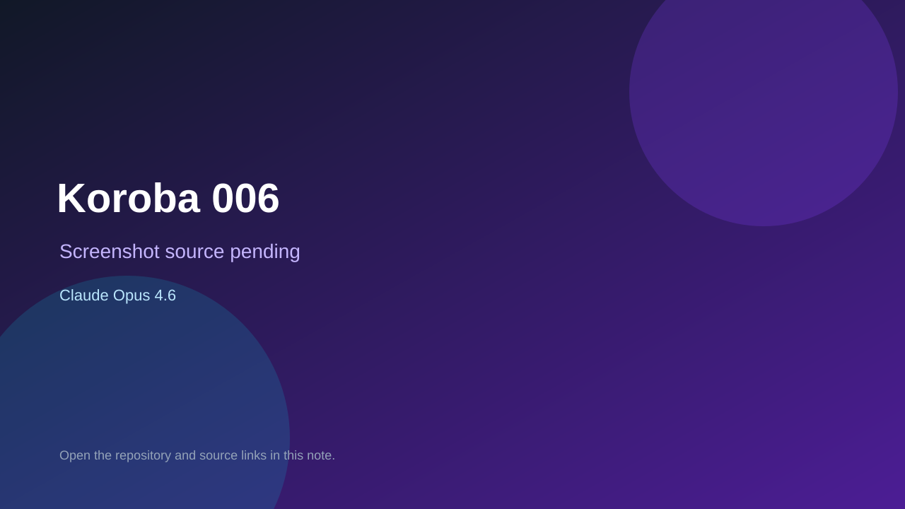

# Koroba 006

> Verified game note.

## At a glance

- **Score:** 7.0/10
- **Model:** Claude Opus 4.6
- **Technology:** Python, Flask, HTML
- **Verified:** 2026-09-09
- **Repository:** [https://github.com/mrgdata/koroba_py](https://github.com/mrgdata/koroba_py)
- **Evidence:** [creator-reported model evidence](https://github.com/mrgdata/koroba_py)

## Screenshots

No screenshot source is recorded yet. Keep the placeholder until a repository, awesome list, or creator source provides an image.

## Model attribution

Open the evidence link above. Evidence grade: **creator-reported model evidence**.

## Source description

README and Python/Flask source contain a local or online multiplayer card game; repository description identifies Claude Opus 4.6.

### Gameplay source

- [https://github.com/mrgdata/koroba_py](https://github.com/mrgdata/koroba_py)

## Verification notes

- **Status:** verified
- **Counted units:** 1
- **Discovery:** https://github.com/mrgdata/koroba_py

[Back to the awesome list](../../README.md)
