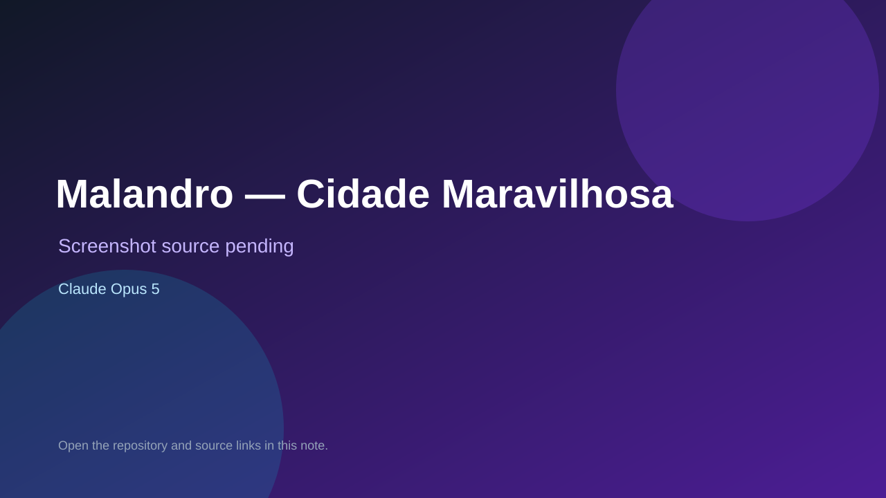

# Malandro — Cidade Maravilhosa

> Verified game note.

## At a glance

- **Score:** 7.5/10
- **Model:** Claude Opus 5
- **Technology:** Three.js, WebGL, JavaScript, Web Audio API
- **Verified:** 2026-09-09
- **Repository:** [https://github.com/herval/gta3-rj-opus5](https://github.com/herval/gta3-rj-opus5)
- **Evidence:** [creator-reported model evidence](https://github.com/herval/gta3-rj-opus5)

## Screenshots

No screenshot source is recorded yet. Keep the placeholder until a repository, awesome list, or creator source provides an image.

## Model attribution

Open the evidence link above. Evidence grade: **creator-reported model evidence**.

## Source description

Playable low-poly open-world GTA-style browser game with vehicles, missions, combat controls, AI, tests, and explicit Opus 5 repository attribution.

### Gameplay source

- [https://github.com/herval/gta3-rj-opus5](https://github.com/herval/gta3-rj-opus5)

## Verification notes

- **Status:** verified
- **Counted units:** 1
- **Discovery:** https://github.com/herval/gta3-rj-opus5

[Back to the awesome list](../../README.md)
