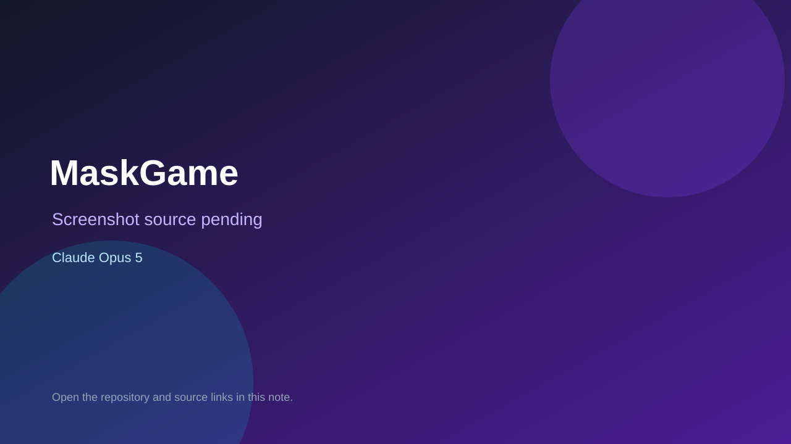

# MaskGame

> Verified game note.

## At a glance

- **Score:** 8.8/10
- **Model:** Claude Opus 5
- **Technology:** Unreal Engine 5.5, C++, Native desktop
- **Verified:** 2026-09-10
- **Repository:** [https://github.com/moeiscool/MaskGame](https://github.com/moeiscool/MaskGame)
- **Evidence:** [direct model evidence](https://github.com/moeiscool/MaskGame/commit/fac98b30e70a8a3a51d81d0a816c5f355cab08f6)

## Screenshots

No screenshot source is recorded yet. Keep the placeholder until a repository, awesome list, or creator source provides an image.

## Model attribution

Open the evidence link above. Evidence grade: **direct model evidence**.

## Source description

The Unreal project README describes an action-adventure with a three-day clock, four masks, thirteen generated regions and four temples. C++ source contains player, enemy, game mode, quests, masks, songs, schedules, world generation, progression and tests. The README states that the runtime greybox builds the regions from data tables and lets the player walk them. The cited commit shows a direct Claude Opus 5 trailer.

### Gameplay source

- [https://github.com/moeiscool/MaskGame/blob/main/README.md](https://github.com/moeiscool/MaskGame/blob/main/README.md)
- [https://github.com/moeiscool/MaskGame/blob/main/Source/MaskGame/Character/MaskCharacter.cpp](https://github.com/moeiscool/MaskGame/blob/main/Source/MaskGame/Character/MaskCharacter.cpp)
- [https://github.com/moeiscool/MaskGame/blob/main/Source/MaskGame/Rules/MaskRules.cpp](https://github.com/moeiscool/MaskGame/blob/main/Source/MaskGame/Rules/MaskRules.cpp)
- [https://github.com/moeiscool/MaskGame/blob/main/Source/MaskGame/World/MaskWorldGenerator.cpp](https://github.com/moeiscool/MaskGame/blob/main/Source/MaskGame/World/MaskWorldGenerator.cpp)
- [https://github.com/moeiscool/MaskGame/commit/fac98b30e70a8a3a51d81d0a816c5f355cab08f6](https://github.com/moeiscool/MaskGame/commit/fac98b30e70a8a3a51d81d0a816c5f355cab08f6)

## Verification notes

- **Status:** verified_source
- **Counted units:** 1
- **Discovery:** GitHub commit search for Unreal playable game Co-Authored-By Claude Opus; https://github.com/moeiscool/MaskGame

[Back to the awesome list](../../README.md)
