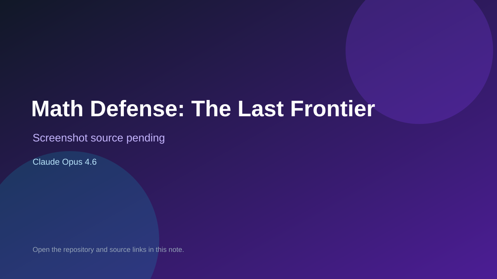

# Math Defense: The Last Frontier

> Verified game note.

## At a glance

- **Score:** 8.0/10
- **Model:** Claude Opus 4.6
- **Technology:** HTML, JavaScript, Canvas 2D, Browser
- **Verified:** 2026-09-10
- **Repository:** [https://github.com/dmbartles/math-defense-the-last-frontier](https://github.com/dmbartles/math-defense-the-last-frontier)
- **Evidence:** [direct model evidence](https://github.com/dmbartles/math-defense-the-last-frontier/blob/main/index.html)

## Screenshots

No screenshot source is recorded yet. Keep the placeholder until a repository, awesome list, or creator source provides an image.

## Model attribution

Open the evidence link above. Evidence grade: **direct model evidence**.

## Source description

The README identifies the repository as a Claude Opus 4.6 experiment. Its 55 KB index.html contains a complete Canvas defense game with a title screen, HUD, score, ammo, waves, a trail map, narrative choices, answer grid, wave banner and game-over screen. The source implements player input, math-answer interactions, enemy/wave progression, collision and win/loss state. No live deployment was found, so count it as source-verified only.

### Gameplay source

- [https://github.com/dmbartles/math-defense-the-last-frontier/blob/main/index.html](https://github.com/dmbartles/math-defense-the-last-frontier/blob/main/index.html)

## Verification notes

- **Status:** verified_source
- **Counted units:** 1
- **Discovery:** Reverse-link expansion from https://github.com/jphein/opus; https://github.com/dmbartles/math-defense-the-last-frontier

[Back to the awesome list](../../README.md)
