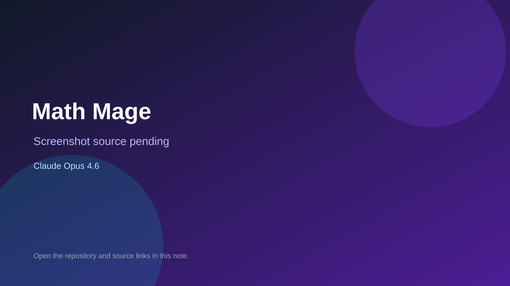

# Math Mage

> Verified game note.

## At a glance

- **Score:** 8.5/10
- **Model:** Claude Opus 4.6
- **Technology:** Godot 4.6, GDScript, Native, Web export
- **Verified:** 2026-09-10
- **Repository:** [https://github.com/Nakamuro-unl/GodotActionGame](https://github.com/Nakamuro-unl/GodotActionGame)
- **Evidence:** [direct model evidence](https://github.com/Nakamuro-unl/GodotActionGame/commit/ab5de8db8e1b4f456faa7de70b593f64085a9ff0)

## Screenshots

No screenshot source is recorded yet. Keep the placeholder until a repository, awesome list, or creator source provides an image.

## Model attribution

Open the evidence link above. Evidence grade: **direct model evidence**.

## Source description

The Godot project contains a playable action-game structure with title/menu, in-game scene, renderer, stages, enemies, skills, result/ranking/settings screens, virtual controls and 290 passing tests. The repository's Godot instructions identify the engine and multiple implementation commits carry Co-Authored-By: Claude Opus 4.6 (1M context). Count it as source-verified because no stable public demo was found.

### Gameplay source

- [https://github.com/Nakamuro-unl/GodotActionGame/tree/main/ingame](https://github.com/Nakamuro-unl/GodotActionGame/tree/main/ingame)
- [https://github.com/Nakamuro-unl/GodotActionGame/commit/ab5de8db8e1b4f456faa7de70b593f64085a9ff0](https://github.com/Nakamuro-unl/GodotActionGame/commit/ab5de8db8e1b4f456faa7de70b593f64085a9ff0)

## Verification notes

- **Status:** verified_source
- **Counted units:** 1
- **Discovery:** GitHub code search for Claude Opus 4.6 game attribution; https://github.com/Nakamuro-unl/GodotActionGame

[Back to the awesome list](../../README.md)
