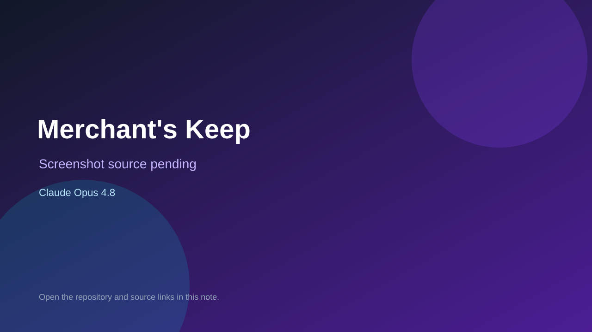

# Merchant's Keep

> Verified game note.

## At a glance

- **Score:** 8.4/10
- **Model:** Claude Opus 4.8
- **Technology:** raylib, C99, Native desktop
- **Verified:** 2026-09-10
- **Repository:** [https://github.com/Afillex/merchants-keep](https://github.com/Afillex/merchants-keep)
- **Evidence:** [direct model evidence](https://github.com/Afillex/merchants-keep/commit/5a5203cad5b169bd6e8ecaf4ef61ed3519ac8a53)

## Screenshots

No screenshot source is recorded yet. Keep the placeholder until a repository, awesome list, or creator source provides an image.

## Model attribution

Open the evidence link above. Evidence grade: **direct model evidence**.

## Source description

The README describes a 2D merchant trading game with a simulated economy, traders, haggling, event cards, reputation, balance and save file. The C99 source uses Raylib and separates game loop, economy, traders, cards and state modules. The cited commit shows a direct Claude Opus 4.8 trailer.

### Gameplay source

- [https://github.com/Afillex/merchants-keep/blob/main/README.md](https://github.com/Afillex/merchants-keep/blob/main/README.md)
- [https://github.com/Afillex/merchants-keep/blob/main/src/main.c](https://github.com/Afillex/merchants-keep/blob/main/src/main.c)
- [https://github.com/Afillex/merchants-keep/commit/5a5203cad5b169bd6e8ecaf4ef61ed3519ac8a53](https://github.com/Afillex/merchants-keep/commit/5a5203cad5b169bd6e8ecaf4ef61ed3519ac8a53)

## Verification notes

- **Status:** verified_source
- **Counted units:** 1
- **Discovery:** GitHub commit search for raylib game Co-Authored-By Claude Opus; https://github.com/Afillex/merchants-keep

[Back to the awesome list](../../README.md)
