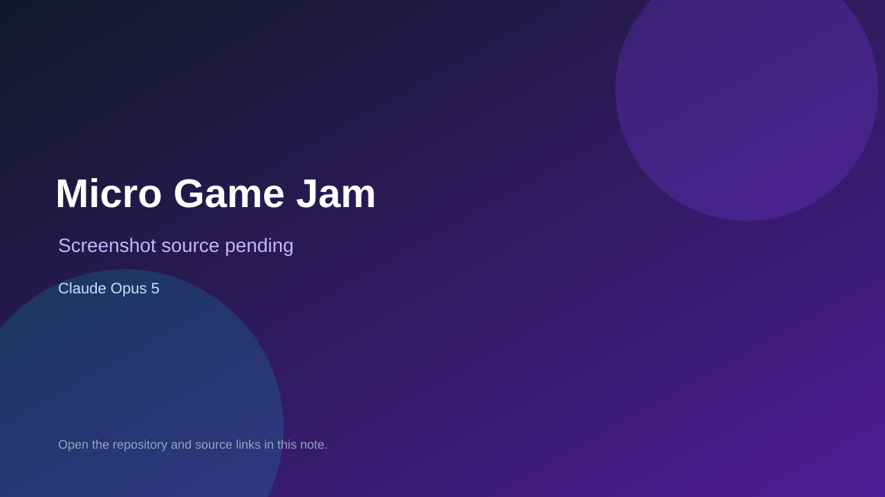

# Micro Game Jam

> Verified game note.

## At a glance

- **Score:** 7.5/10
- **Model:** Claude Opus 5
- **Technology:** Godot, GDScript, Native desktop
- **Verified:** 2026-09-10
- **Repository:** [https://github.com/miromustafa/micro-game-jam](https://github.com/miromustafa/micro-game-jam)
- **Evidence:** [direct model evidence](https://github.com/miromustafa/micro-game-jam/commit/84deda9f0a67c5cc9b6f982d2db61e0eff0d9234)

## Screenshots

No screenshot source is recorded yet. Keep the placeholder until a repository, awesome list, or creator source provides an image.

## Model attribution

Open the evidence link above. Evidence grade: **direct model evidence**.

## Source description

The initial commit is explicitly a Godot game project and contains project.godot, the game scene and controller scripts, plus player, plane, mover, bomb, bullet, explosion and game-over scenes. The commit includes a direct Claude Opus 5 trailer.

### Gameplay source

- [https://github.com/miromustafa/micro-game-jam/blob/84deda9f0a67c5cc9b6f982d2db61e0eff0d9234/project.godot](https://github.com/miromustafa/micro-game-jam/blob/84deda9f0a67c5cc9b6f982d2db61e0eff0d9234/project.godot)
- [https://github.com/miromustafa/micro-game-jam/blob/84deda9f0a67c5cc9b6f982d2db61e0eff0d9234/Scenes/game.gd](https://github.com/miromustafa/micro-game-jam/blob/84deda9f0a67c5cc9b6f982d2db61e0eff0d9234/Scenes/game.gd)
- [https://github.com/miromustafa/micro-game-jam/blob/84deda9f0a67c5cc9b6f982d2db61e0eff0d9234/Scenes/game.tscn](https://github.com/miromustafa/micro-game-jam/blob/84deda9f0a67c5cc9b6f982d2db61e0eff0d9234/Scenes/game.tscn)
- [https://github.com/miromustafa/micro-game-jam/commit/84deda9f0a67c5cc9b6f982d2db61e0eff0d9234](https://github.com/miromustafa/micro-game-jam/commit/84deda9f0a67c5cc9b6f982d2db61e0eff0d9234)

## Verification notes

- **Status:** verified_source
- **Counted units:** 1
- **Discovery:** GitHub commit search for Godot game Co-Authored-By Claude Opus; https://github.com/miromustafa/micro-game-jam

[Back to the awesome list](../../README.md)
