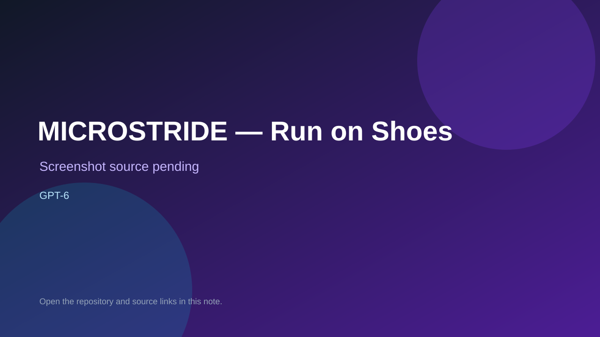

# MICROSTRIDE — Run on Shoes

> Verified game note.

## At a glance

- **Score:** 8.9/10
- **Model:** GPT-6
- **Technology:** React, TypeScript, Three.js, Vite, glTF, WebGL, Browser
- **Verified:** 2026-09-10
- **Repository:** [https://github.com/565353780/run-on-shoes](https://github.com/565353780/run-on-shoes)
- **Evidence:** [direct model evidence](https://github.com/565353780/run-on-shoes#%E7%8E%A9%E6%B3%95)
- **Live demo:** [open demo](https://565353780.github.io/run-on-shoes/)

## Screenshots

No screenshot source is recorded yet. Keep the placeholder until a repository, awesome list, or creator source provides an image.

## Model attribution

Open the evidence link above. Evidence grade: **direct model evidence**.

## Source description

The README explicitly identifies a React/TypeScript/Three.js browser game powered by GPT6 and Hi3D. It documents running, jumping and sprinting across a giant shoe, camera control, changing scale, laser and meteor hazards, touch controls, pause, local assets and a complete static build. The repository contains the React runtime, typed game API, movement/gravity/disaster methods, glTF models, tests, asset manifest and GitHub Pages workflow. Browser verification opened the public build and showed the 3D shoe world, scale slider, loading state, controls and GPT6 attribution. Count GPT-6 as the qualifying Astra-era model label supplied by the repository.

### Gameplay source

- [https://github.com/565353780/run-on-shoes#%E7%8E%A9%E6%B3%95](https://github.com/565353780/run-on-shoes#%E7%8E%A9%E6%B3%95)

## Verification notes

- **Status:** verified
- **Counted units:** 1
- **Discovery:** https://github.com/565353780/run-on-shoes; https://api.github.com/search/repositories?q=GPT6+game+in%3Areadme

[Back to the awesome list](../../README.md)
