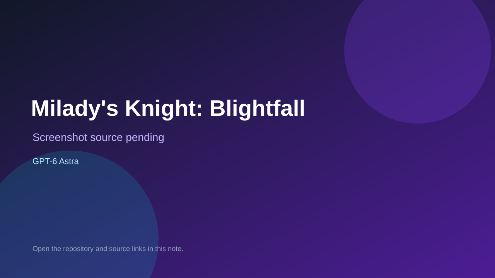

# Milady's Knight: Blightfall

> Verified game note.

## At a glance

- **Score:** 8.2/10
- **Model:** GPT-6 Astra
- **Technology:** Godot 4.5.1, GDScript, Native desktop
- **Verified:** 2026-09-10
- **Repository:** [https://github.com/crousty24-bit/Milady-s-Knight-godot](https://github.com/crousty24-bit/Milady-s-Knight-godot)
- **Evidence:** [direct model evidence](https://github.com/crousty24-bit/Milady-s-Knight-godot#miladys-knight-blightfall)

## Screenshots

No screenshot source is recorded yet. Keep the placeholder until a repository, awesome list, or creator source provides an image.

## Model attribution

Open the evidence link above. Evidence grade: **direct model evidence**.

## Source description

The README explicitly credits Astra GPT-6 and describes a playable Godot 4.5.1 2D action-platformer vertical slice. The repository contains project.godot, scenes, GDScript gameplay systems, assets, a gate-and-coin objective, two routes, slimes, sword combat, movement mechanics, persistence, launch scripts and 150 passing engine-level tests. It provides no hosted browser build or packaged export, so classify it under Non-Browser Engines and do not claim live browser verification.

### Gameplay source

- [https://github.com/crousty24-bit/Milady-s-Knight-godot#miladys-knight-blightfall](https://github.com/crousty24-bit/Milady-s-Knight-godot#miladys-knight-blightfall)

## Verification notes

- **Status:** verified
- **Counted units:** 1
- **Discovery:** https://api.github.com/search/repositories?q=%22GPT-6%22+playable+game+in%3Areadme

[Back to the awesome list](../../README.md)
