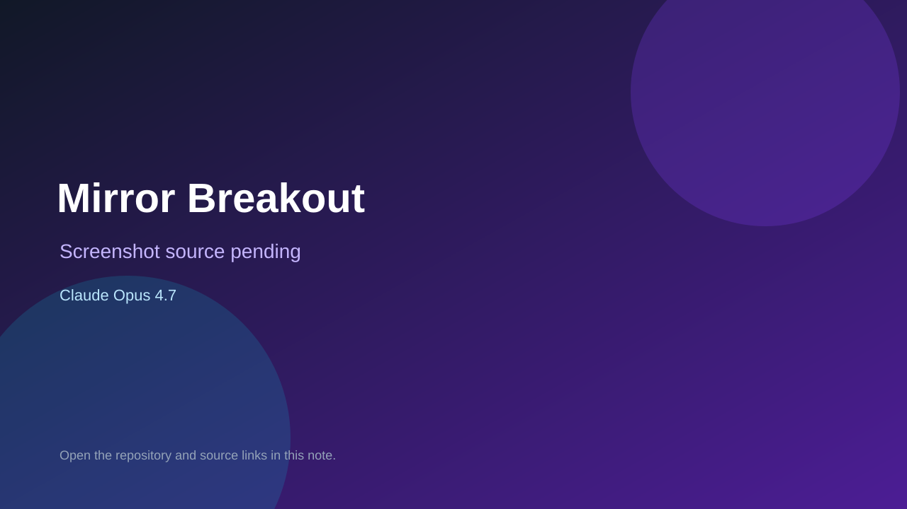

# Mirror Breakout

> Verified game note.

## At a glance

- **Score:** 7.0/10
- **Model:** Claude Opus 4.7
- **Technology:** HTML, Canvas, JavaScript
- **Verified:** 2026-09-09
- **Repository:** [https://github.com/tbensonwest/claude-4-7-breakout-oneshot-demo](https://github.com/tbensonwest/claude-4-7-breakout-oneshot-demo)
- **Evidence:** [creator-reported model evidence](https://github.com/tbensonwest/claude-4-7-breakout-oneshot-demo/blob/main/README.md)

## Screenshots

No screenshot source is recorded yet. Keep the placeholder until a repository, awesome list, or creator source provides an image.

## Model attribution

Open the evidence link above. Evidence grade: **creator-reported model evidence**.

## Source description

README and single-file source contain a playable Canvas Breakout variant generated one-shot by Claude Opus 4.7.

### Gameplay source

- [https://github.com/tbensonwest/claude-4-7-breakout-oneshot-demo/blob/main/README.md](https://github.com/tbensonwest/claude-4-7-breakout-oneshot-demo/blob/main/README.md)

## Verification notes

- **Status:** verified
- **Counted units:** 1
- **Discovery:** https://github.com/tbensonwest/claude-4-7-breakout-oneshot-demo

[Back to the awesome list](../../README.md)
