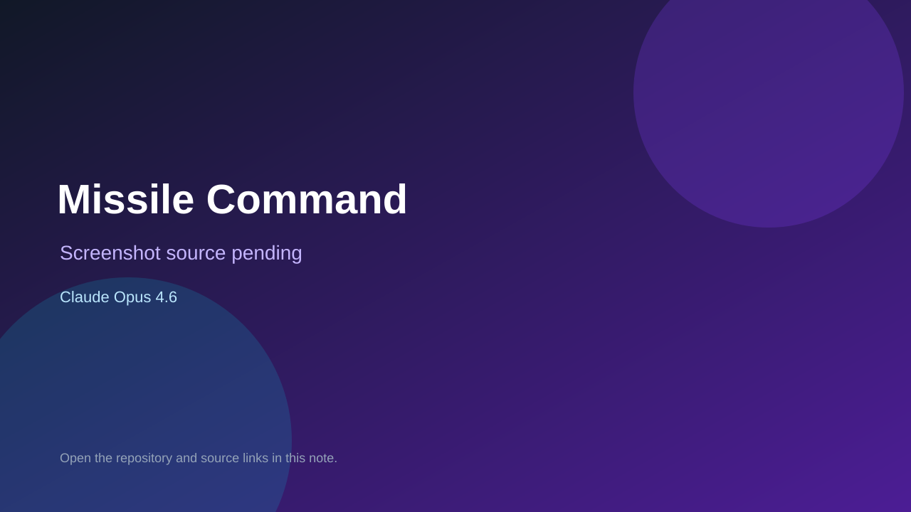

# Missile Command

> Verified game note.

## At a glance

- **Score:** 8.6/10
- **Model:** Claude Opus 4.6
- **Technology:** HTML, JavaScript ES modules, Canvas 2D, Web Audio API, Browser
- **Verified:** 2026-09-10
- **Repository:** [https://github.com/argusbrown/missile_command](https://github.com/argusbrown/missile_command)
- **Evidence:** [direct model evidence](https://github.com/argusbrown/missile_command#gameplay)

## Screenshots

No screenshot source is recorded yet. Keep the placeholder until a repository, awesome list, or creator source provides an image.

## Model attribution

Open the evidence link above. Evidence grade: **direct model evidence**.

## Source description

The README documents a complete single-file browser Missile Command game with six cities, three missile bases, mouse aim and click-to-fire controls, expanding chain explosions, scoring, wave progression, MIRVs, bonus cities, game-over state and local high-score persistence. It explicitly credits Claude Opus 4.6 and lists the Canvas game source structure.

### Gameplay source

- [https://github.com/argusbrown/missile_command/blob/main/index.html](https://github.com/argusbrown/missile_command/blob/main/index.html)
- [https://github.com/argusbrown/missile_command#gameplay](https://github.com/argusbrown/missile_command#gameplay)

## Verification notes

- **Status:** verified_source_and_single_file_build
- **Counted units:** 1
- **Discovery:** GitHub repository search: "built with Claude Opus 4.6" game in:readme; https://github.com/argusbrown/missile_command

[Back to the awesome list](../../README.md)
