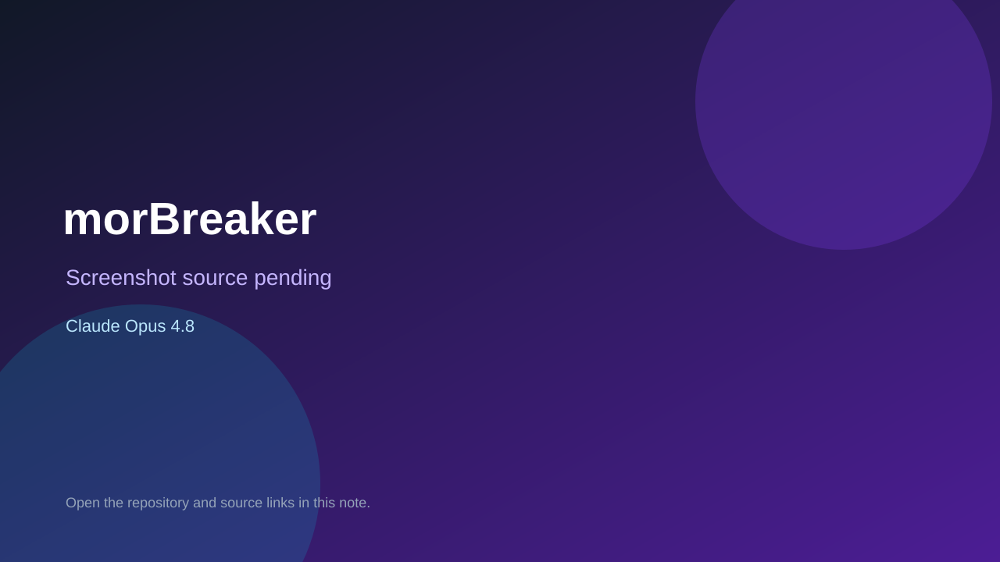

# morBreaker

> Verified game note.

## At a glance

- **Score:** 8.6/10
- **Model:** Claude Opus 4.8
- **Technology:** Unity 6, C#, URP, Native Windows, WebGL
- **Verified:** 2026-09-10
- **Repository:** [https://github.com/KingMordas/mor-breaker](https://github.com/KingMordas/mor-breaker)
- **Evidence:** [direct model evidence](https://github.com/KingMordas/mor-breaker/commit/53b41b02baa12440e62b01e585ee347bfee35845)

## Screenshots

No screenshot source is recorded yet. Keep the placeholder until a repository, awesome list, or creator source provides an image.

## Model attribution

Open the evidence link above. Evidence grade: **direct model evidence**.

## Source description

The Unity project is a complete 2D brick-breaker with a paddle, ball, bricks, ten levels, score/lives/win flow, local high scores and Windows/WebGL targets. The initial public-import commit explicitly describes the complete Unity project and carries Co-Authored-By: Claude Opus 4.8. Count it as source-verified because no public demo URL was found.

### Gameplay source

- [https://github.com/KingMordas/mor-breaker/blob/main/Assets/Scenes/SampleScene.unity](https://github.com/KingMordas/mor-breaker/blob/main/Assets/Scenes/SampleScene.unity)
- [https://github.com/KingMordas/mor-breaker/blob/main/Assets/Scripts/GameManager.cs](https://github.com/KingMordas/mor-breaker/blob/main/Assets/Scripts/GameManager.cs)
- [https://github.com/KingMordas/mor-breaker/blob/main/Assets/Scripts/BallController.cs](https://github.com/KingMordas/mor-breaker/blob/main/Assets/Scripts/BallController.cs)
- [https://github.com/KingMordas/mor-breaker/blob/main/Assets/Scripts/BrickController.cs](https://github.com/KingMordas/mor-breaker/blob/main/Assets/Scripts/BrickController.cs)
- [https://github.com/KingMordas/mor-breaker/blob/main/Assets/Scripts/PaddleController.cs](https://github.com/KingMordas/mor-breaker/blob/main/Assets/Scripts/PaddleController.cs)
- [https://github.com/KingMordas/mor-breaker/commit/53b41b02baa12440e62b01e585ee347bfee35845](https://github.com/KingMordas/mor-breaker/commit/53b41b02baa12440e62b01e585ee347bfee35845)

## Verification notes

- **Status:** verified_source
- **Counted units:** 1
- **Discovery:** GitHub code search for Claude Opus 4.6 game attribution; https://github.com/KingMordas/mor-breaker

[Back to the awesome list](../../README.md)
