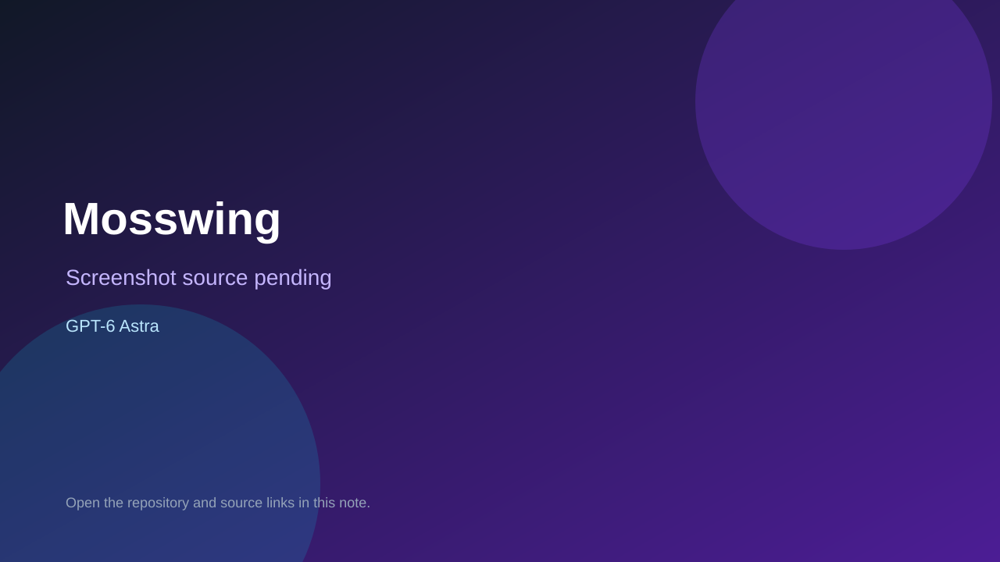

# Mosswing

> Verified game note.

## At a glance

- **Score:** 8.4/10
- **Model:** GPT-6 Astra
- **Technology:** HTML, CSS, JavaScript, Canvas 2D, Three.js, Browser
- **Verified:** 2026-09-10
- **Repository:** [https://github.com/Ayi1337/gpt6-astra-one-shot-games](https://github.com/Ayi1337/gpt6-astra-one-shot-games)
- **Evidence:** [direct model evidence](https://github.com/Ayi1337/gpt6-astra-one-shot-games#-01--)

## Screenshots

No screenshot source is recorded yet. Keep the placeholder until a repository, awesome list, or creator source provides an image.

## Model attribution

Open the evidence link above. Evidence grade: **direct model evidence**.

## Source description

The README documents two separate one-shot games and preserves each prompt, HTML artifact and source directory. Melon Lab is a semi-fluid fruit-merging game with gravity, elasticity, aim, drop, stir, energy, score, pause and restart. Mosswing is a 3D one-tap flight game with gaps, gravity, score and one-collision failure. Both README sections attribute the experiments to GPT-6 Astra, and both public demos were opened: Melon Lab showed its fruit pool, score, next fruit, physics modes, energy and controls; Mosswing showed the game canvas, score, best score, start button and one-collision instructions. Count two game units under one repository, not the prompts separately.

### Gameplay source

- [https://github.com/Ayi1337/gpt6-astra-one-shot-games/tree/main/melon-lab](https://github.com/Ayi1337/gpt6-astra-one-shot-games/tree/main/melon-lab)
- [https://github.com/Ayi1337/gpt6-astra-one-shot-games/tree/main/mosswing](https://github.com/Ayi1337/gpt6-astra-one-shot-games/tree/main/mosswing)
- [https://github.com/Ayi1337/gpt6-astra-one-shot-games#-01--](https://github.com/Ayi1337/gpt6-astra-one-shot-games#-01--)

## Verification notes

- **Status:** verified
- **Counted units:** 2
- **Discovery:** https://github.com/Ayi1337/gpt6-astra-one-shot-games; https://api.github.com/search/repositories?q=%22GPT-6%22+playable+game+in%3Areadme

[Back to the awesome list](../../README.md)
