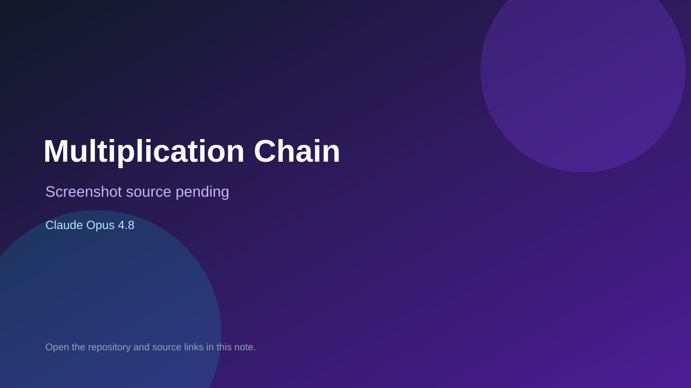

# Multiplication Chain

> Verified game note.

## At a glance

- **Score:** 9.3/10
- **Model:** Claude Opus 4.8
- **Technology:** JavaScript, HTML, Canvas 2D, Static browser app
- **Verified:** 2026-09-12
- **Repository:** [https://github.com/mundeok/math-arcade-paradise](https://github.com/mundeok/math-arcade-paradise)
- **Evidence:** [direct model evidence](https://github.com/mundeok/math-arcade-paradise/commit/6084d3bcafe3057b87a409ff1b20c84be90ed445)

## Screenshots

No screenshot source is recorded yet. Keep the placeholder until a repository, awesome list, or creator source provides an image.

## Model attribution

Open the evidence link above. Evidence grade: **direct model evidence**.

## Source description

The project summary defines Math Arcade Paradise as a static HTML/JavaScript educational arcade and lists 11 implemented games: combo, catch, racing, timing, matching, stack, shooting, chain, balloons, remainder treasure and multiplication farm. src/games/registry.js registers the implemented game modules, and the source tree contains separate files for the game modes. The repository also includes game browser smoke tests and focused tests for the farm mode. The cited menu/game commit contains an exact Co-Authored-By: Claude Opus 4.8 trailer. The inferred GitHub Pages and Vercel URLs returned HTTP 404 during verification, so no live demo is claimed. Exclude the dummy entry and hidden legacy delivery experiment from the count.

### Gameplay source

- [https://github.com/mundeok/math-arcade-paradise/blob/master/PROJECT_FULL_SUMMARY.md](https://github.com/mundeok/math-arcade-paradise/blob/master/PROJECT_FULL_SUMMARY.md)
- [https://github.com/mundeok/math-arcade-paradise/blob/master/src/games/registry.js](https://github.com/mundeok/math-arcade-paradise/blob/master/src/games/registry.js)
- [https://github.com/mundeok/math-arcade-paradise/tree/master/src/games](https://github.com/mundeok/math-arcade-paradise/tree/master/src/games)
- [https://github.com/mundeok/math-arcade-paradise/tree/master/tests](https://github.com/mundeok/math-arcade-paradise/tree/master/tests)
- [https://github.com/mundeok/math-arcade-paradise/commit/6084d3bcafe3057b87a409ff1b20c84be90ed445](https://github.com/mundeok/math-arcade-paradise/commit/6084d3bcafe3057b87a409ff1b20c84be90ed445)

## Verification notes

- **Status:** verified_source
- **Counted units:** 11
- **Discovery:** GitHub commit search for game Co-Authored-By Claude Opus, 2026-09-10..2026-09-12; https://github.com/mundeok/math-arcade-paradise

[Back to the awesome list](../../README.md)
