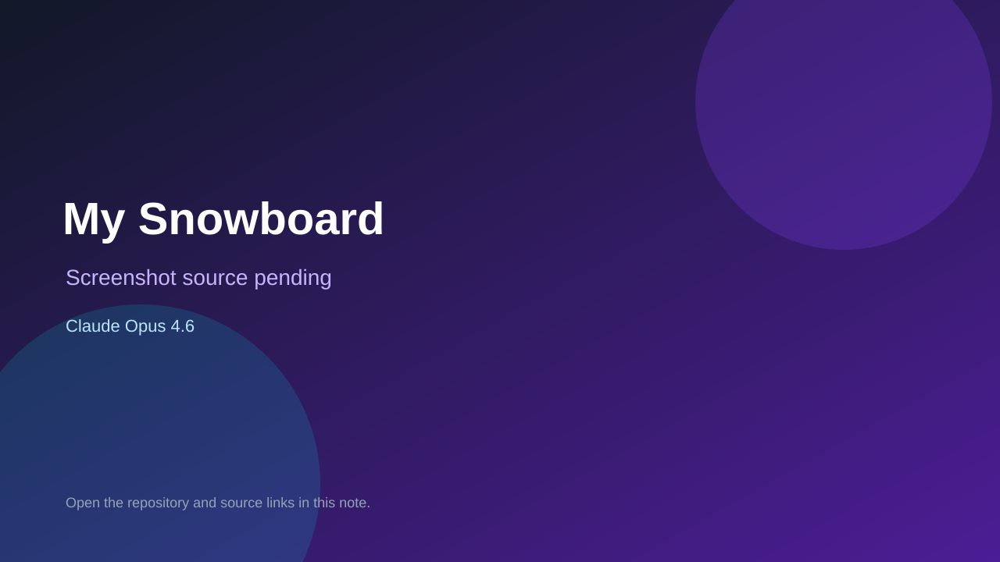

# My Snowboard

> Verified game note.

## At a glance

- **Score:** 8.4/10
- **Model:** Claude Opus 4.6
- **Technology:** HTML, JavaScript, Canvas 2D, Web Audio API, Browser
- **Verified:** 2026-09-10
- **Repository:** [https://github.com/petersomerville/mysnowboard](https://github.com/petersomerville/mysnowboard)
- **Evidence:** [direct model evidence](https://github.com/petersomerville/mysnowboard#how-to-play)
- **Live demo:** [open demo](https://my-snowboard.vercel.app/)

## Screenshots

No screenshot source is recorded yet. Keep the placeholder until a repository, awesome list, or creator source provides an image.

## Model attribution

Open the evidence link above. Evidence grade: **direct model evidence**.

## Source description

The README links a live browser build and documents a complete snowboarding game loop: name and mode selection, hill difficulty, weather, trick choice, charge-and-release launch, timed landing, health, game over, coins, chalet food, permanent gear upgrades, trick combos and a local leaderboard. It explicitly says the game was built with the help of Claude Opus 4.6 and Cursor, and identifies the Canvas, Web Audio and JavaScript implementation.

### Gameplay source

- [https://github.com/petersomerville/mysnowboard](https://github.com/petersomerville/mysnowboard)
- [https://github.com/petersomerville/mysnowboard#how-to-play](https://github.com/petersomerville/mysnowboard#how-to-play)

## Verification notes

- **Status:** verified_source_and_live_demo
- **Counted units:** 1
- **Discovery:** GitHub code search: "Claude Opus 4.6" game; https://github.com/petersomerville/mysnowboard

[Back to the awesome list](../../README.md)
