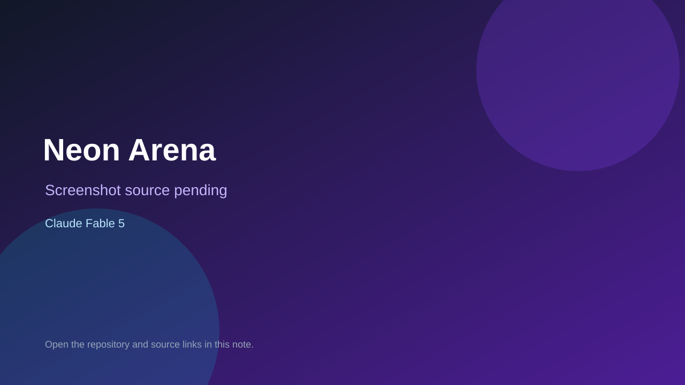

# Neon Arena

> Verified game note.

## At a glance

- **Score:** 8.0/10
- **Model:** Claude Fable 5
- **Technology:** TypeScript, Vite, Three.js
- **Verified:** 2026-09-09
- **Repository:** [https://github.com/B-Blarr/Arena-Game](https://github.com/B-Blarr/Arena-Game)
- **Evidence:** [creator-reported model evidence](https://github.com/B-Blarr/Arena-Game/blob/main/README.md)

## Screenshots

No screenshot source is recorded yet. Keep the placeholder until a repository, awesome list, or creator source provides an image.

## Model attribution

Open the evidence link above. Evidence grade: **creator-reported model evidence**.

## Source description

README, src, and tests describe a playable Three.js arena roguelite with enemy waves, upgrades, bosses, unlockable heroes, and procedural graphics; README identifies Claude Fable.

### Gameplay source

- [https://github.com/B-Blarr/Arena-Game/blob/main/README.md](https://github.com/B-Blarr/Arena-Game/blob/main/README.md)

## Verification notes

- **Status:** verified
- **Counted units:** 1
- **Discovery:** https://github.com/B-Blarr/Arena-Game

[Back to the awesome list](../../README.md)
