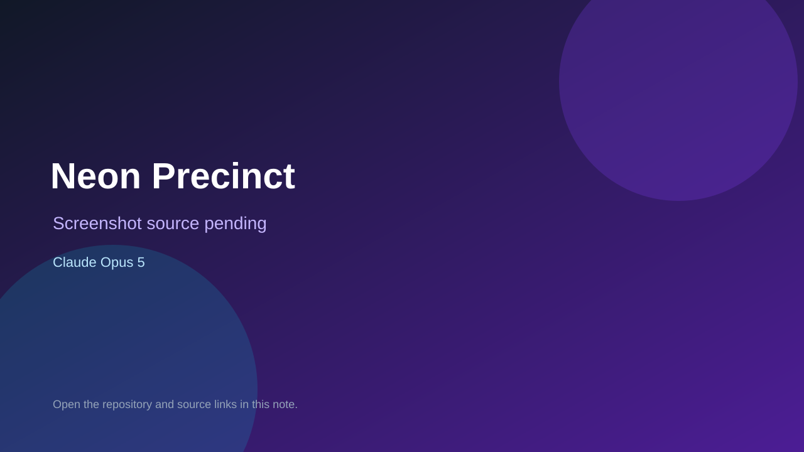

# Neon Precinct

> Verified game note.

## At a glance

- **Score:** 7.0/10
- **Model:** Claude Opus 5
- **Technology:** Three.js, JavaScript, WebGL
- **Verified:** 2026-09-09
- **Repository:** [https://github.com/dylanhsieh/neon-precinct](https://github.com/dylanhsieh/neon-precinct)
- **Evidence:** [directory-method model evidence](https://github.com/dylanhsieh/neon-precinct)

## Screenshots

No screenshot source is recorded yet. Keep the placeholder until a repository, awesome list, or creator source provides an image.

## Model attribution

Open the evidence link above. Evidence grade: **directory-method model evidence**.

## Source description

Playable first-person cyberpunk exploration game; README links the build to a blind-critic Gauntlet Loop and records the score.

### Gameplay source

- [https://github.com/dylanhsieh/neon-precinct](https://github.com/dylanhsieh/neon-precinct)

## Verification notes

- **Status:** verified
- **Counted units:** 1
- **Discovery:** https://github.com/dylanhsieh/neon-precinct

[Back to the awesome list](../../README.md)
