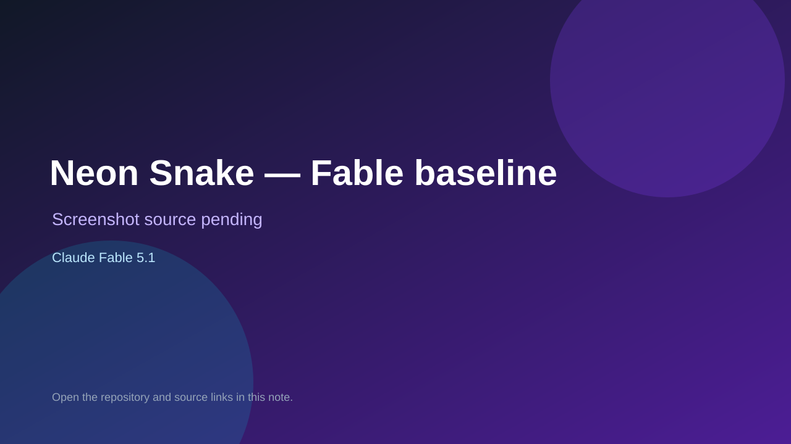

# Neon Snake — Fable baseline

> Verified game note.

## At a glance

- **Score:** 8.7/10
- **Model:** Claude Fable 5.1
- **Technology:** Phaser 4, TypeScript, Tone.js, Canvas, Browser
- **Verified:** 2026-09-10
- **Repository:** [https://github.com/kinncj/neon-snake](https://github.com/kinncj/neon-snake)
- **Evidence:** [direct model evidence](https://github.com/kinncj/neon-snake#the-game)
- **Live demo:** [open demo](https://kinncj.github.io/neon-snake/claude-code-fable/)

## Screenshots

No screenshot source is recorded yet. Keep the placeholder until a repository, awesome list, or creator source provides an image.

## Model attribution

Open the evidence link above. Evidence grade: **direct model evidence**.

## Source description

The repository contains four independent builds of one game specification. Count only the claude-code-fable baseline because it explicitly credits Claude Fable 5.1. The baseline has a live GitHub Pages build, a pure-integer deterministic snake simulation, five levels, combo progression, five palettes, five lo-fi tracks, i18n, quality tiers, replayable input logs, Playwright gates and documented playtest artifacts. The other three Qwen/opencode builds are excluded from this model-scoped count.

### Gameplay source

- [https://github.com/kinncj/neon-snake/tree/main/claude-code-fable](https://github.com/kinncj/neon-snake/tree/main/claude-code-fable)
- [https://kinncj.github.io/neon-snake/claude-code-fable/](https://kinncj.github.io/neon-snake/claude-code-fable/)
- [https://github.com/kinncj/neon-snake#the-game](https://github.com/kinncj/neon-snake#the-game)

## Verification notes

- **Status:** verified_source_and_live_demo
- **Counted units:** 1
- **Discovery:** GitHub repository search: "Claude Fable 5.1" built game in:readme; https://github.com/kinncj/neon-snake

[Back to the awesome list](../../README.md)
