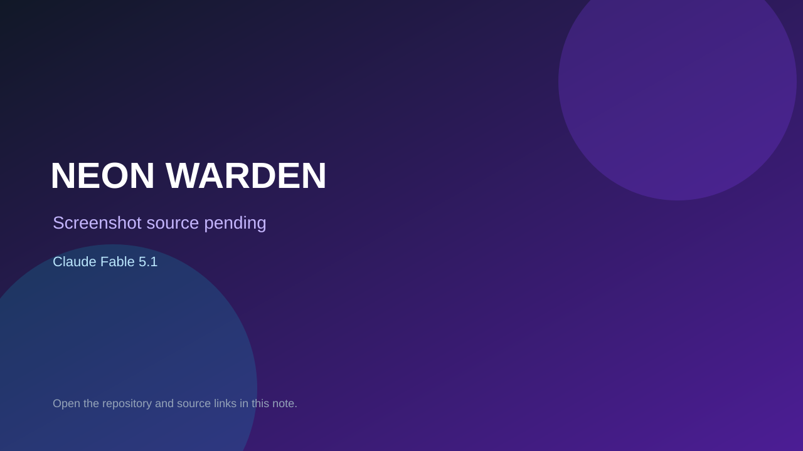

# NEON WARDEN

> Verified game note.

## At a glance

- **Score:** 9.0/10
- **Model:** Claude Fable 5.1
- **Technology:** Three.js, GLTFLoader, WebGL, HTML, JavaScript, Blender, Browser
- **Verified:** 2026-09-09
- **Repository:** [https://github.com/Nipale-ai/fable-5-1-one-prompt-game](https://github.com/Nipale-ai/fable-5-1-one-prompt-game)
- **Evidence:** [direct model evidence](https://github.com/Nipale-ai/fable-5-1-one-prompt-game#what-it-built-itself)
- **Live demo:** [open demo](https://nipale-ai.github.io/fable-5-1-one-prompt-game/fable/)

## Screenshots

No screenshot source is recorded yet. Keep the placeholder until a repository, awesome list, or creator source provides an image.

## Model attribution

Open the evidence link above. Evidence grade: **direct model evidence**.

## Source description

The README documents a self-contained 3D browser game with a floating arena, mech movement, mouse aiming, cannon fire, phase dash, ten hostile waves, cores, upgrades, generated assets, audio and video. It explicitly identifies Claude Fable 5.1, a one-prompt 24-minute build, Three.js/GLTFLoader/UnrealBloom, Playwright wave tests and a public demo. Browser verification opened the game, showed the deploy screen and started Wave 1 with hull, hostiles, score, cores, controls and objective HUD.

### Gameplay source

- [https://github.com/Nipale-ai/fable-5-1-one-prompt-game/tree/main/fable](https://github.com/Nipale-ai/fable-5-1-one-prompt-game/tree/main/fable)
- [https://github.com/Nipale-ai/fable-5-1-one-prompt-game#what-it-built-itself](https://github.com/Nipale-ai/fable-5-1-one-prompt-game#what-it-built-itself)

## Verification notes

- **Status:** verified
- **Counted units:** 1
- **Discovery:** https://github.com/Nipale-ai/fable-5-1-one-prompt-game

[Back to the awesome list](../../README.md)
