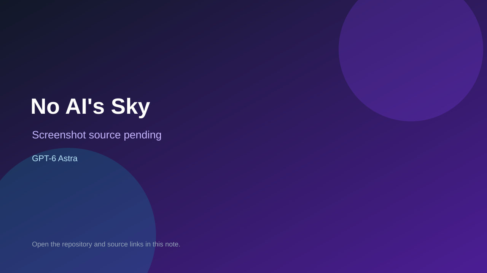

# No AI's Sky

> Verified game note.

## At a glance

- **Score:** 8.0/10
- **Model:** GPT-6 Astra
- **Technology:** Three.js, Vite, JavaScript, WebGL
- **Verified:** 2026-09-09
- **Repository:** [https://github.com/jesuscurreripa/noaissky](https://github.com/jesuscurreripa/noaissky)
- **Evidence:** [creator-reported model evidence](https://github.com/jesuscurreripa/noaissky/blob/main/README.md)

## Screenshots

No screenshot source is recorded yet. Keep the placeholder until a repository, awesome list, or creator source provides an image.

## Model attribution

Open the evidence link above. Evidence grade: **creator-reported model evidence**.

## Source description

README and creator Reddit post describe a playable browser experiment with procedural universes, flight, atmospheric landing, on-foot exploration, scanning, optional combat, and a live demo. The creator directly reports building it with GPT-6 Astra and Three.js; the Reddit post was published today.

### Gameplay source

- [https://github.com/jesuscurreripa/noaissky/blob/main/README.md](https://github.com/jesuscurreripa/noaissky/blob/main/README.md)

## Verification notes

- **Status:** verified
- **Counted units:** 1
- **Discovery:** https://github.com/jesuscurreripa/noaissky; https://www.reddit.com/r/vibecoding/comments/1wamzs7/no_ais_sky_a_threejs_experiment_built_with_gpt6/

[Back to the awesome list](../../README.md)
