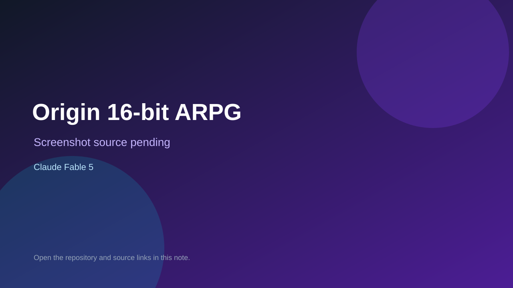

# Origin 16-bit ARPG

> Verified game note.

## At a glance

- **Score:** 7.5/10
- **Model:** Claude Fable 5
- **Technology:** HTML, JavaScript, Canvas 2D
- **Verified:** 2026-09-09
- **Repository:** [https://github.com/DFarm6/origin-16bit-arpg](https://github.com/DFarm6/origin-16bit-arpg)
- **Evidence:** [creator-reported model evidence](https://github.com/DFarm6/origin-16bit-arpg)

## Screenshots

No screenshot source is recorded yet. Keep the placeholder until a repository, awesome list, or creator source provides an image.

## Model attribution

Open the evidence link above. Evidence grade: **creator-reported model evidence**.

## Source description

Playable browser action RPG with classes, combat, skills, items, bosses, quests, and GitHub Pages deployment; README names Fable 5.

### Gameplay source

- [https://github.com/DFarm6/origin-16bit-arpg](https://github.com/DFarm6/origin-16bit-arpg)

## Verification notes

- **Status:** verified
- **Counted units:** 1
- **Discovery:** https://github.com/DFarm6/origin-16bit-arpg

[Back to the awesome list](../../README.md)
