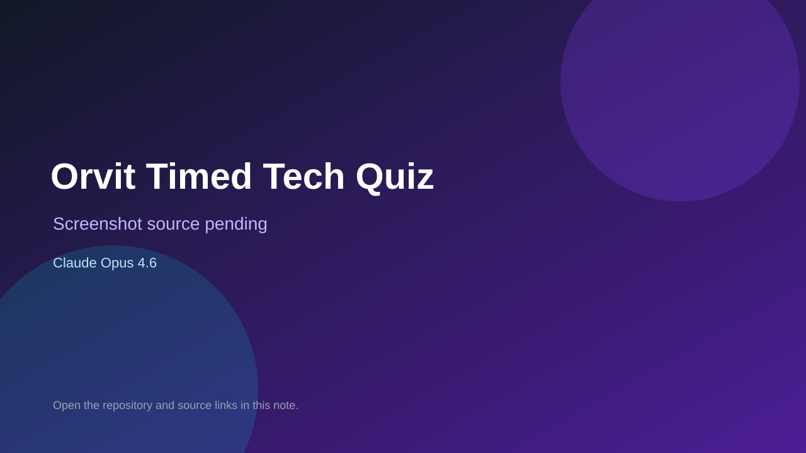

# Orvit Timed Tech Quiz

> Verified game note.

## At a glance

- **Score:** 8.0/10
- **Model:** Claude Opus 4.6
- **Technology:** Next.js, React, TypeScript, Browser
- **Verified:** 2026-09-10
- **Repository:** [https://github.com/dnd-side-project/dnd-14th-6-frontend](https://github.com/dnd-side-project/dnd-14th-6-frontend)
- **Evidence:** [model evidence with supporting game code](https://github.com/dnd-side-project/dnd-14th-6-frontend/commit/fab20df22b2058465ba6c1156e87d96028ab5566)

## Screenshots

No screenshot source is recorded yet. Keep the placeholder until a repository, awesome list, or creator source provides an image.

## Model attribution

Open the evidence link above. Evidence grade: **model evidence with supporting game code**.

## Source description

The Next.js source contains a real timed tech quiz: users select Git, Linux or Docker categories and Easy, Normal, Hard or Random difficulty, then solve timed answer cards. GamePlayPage implements tutorial, playing, clear/timeout end states, audio, scoring and result navigation. The cited game-UI commit adds the game header, score table, timer and time bar, with repeated Co-Authored-By: Claude Opus 4.6 trailers. Label attribution as supporting-feature-level, not full-repository authorship.

### Gameplay source

- [https://github.com/dnd-side-project/dnd-14th-6-frontend/tree/develop/src/app/game/play](https://github.com/dnd-side-project/dnd-14th-6-frontend/tree/develop/src/app/game/play)
- [https://github.com/dnd-side-project/dnd-14th-6-frontend/commit/fab20df22b2058465ba6c1156e87d96028ab5566](https://github.com/dnd-side-project/dnd-14th-6-frontend/commit/fab20df22b2058465ba6c1156e87d96028ab5566)

## Verification notes

- **Status:** verified_source
- **Counted units:** 1
- **Discovery:** GitHub commit search for game Co-Authored-By Claude Opus 4.6; https://github.com/dnd-side-project/dnd-14th-6-frontend

[Back to the awesome list](../../README.md)
