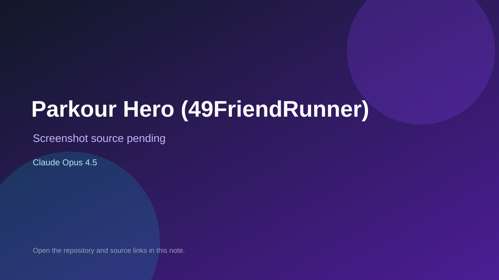

# Parkour Hero (49FriendRunner)

> Verified game note.

## At a glance

- **Score:** 8.5/10
- **Model:** Claude Opus 4.5
- **Technology:** Cocos Creator 2.4.13, TypeScript, DragonBones, Custom 2D physics, WeChat/Alipay/QQ mini-games, Native editor project
- **Verified:** 2026-09-10
- **Repository:** [https://github.com/TinycellCorp/Parkour](https://github.com/TinycellCorp/Parkour)
- **Evidence:** [direct model evidence](https://github.com/TinycellCorp/Parkour/commit/f26ca9fcae29b6c130cae7f56b70356afa25918)

## Screenshots

No screenshot source is recorded yet. Keep the placeholder until a repository, awesome list, or creator source provides an image.

## Model attribution

Open the evidence link above. Evidence grade: **direct model evidence**.

## Source description

The repository contains a complete Cocos Creator 2.4.13 2D endless-runner project named Parkour Hero/49FriendRunner. Its project instructions identify player, pet, buff, game-mode, UI, scene, animation and custom-physics source under assets/Game, and its platform section targets WeChat, Alipay and QQ mini-games. The repository contains extensive game assets, scenes, animations, TypeScript gameplay code and a local Cocos editor test URL. Its history includes exact Claude Opus 4.5 trailers on game-script, scene, UI and asset changes. Count the Cocos game once and keep it in Non-Browser Engines.

### Gameplay source

- [https://github.com/TinycellCorp/Parkour/tree/main/assets/Game](https://github.com/TinycellCorp/Parkour/tree/main/assets/Game)
- [https://github.com/TinycellCorp/Parkour/blob/main/assets/Game/Script/game/Game.ts](https://github.com/TinycellCorp/Parkour/blob/main/assets/Game/Script/game/Game.ts)
- [https://github.com/TinycellCorp/Parkour/blob/main/assets/Game/Script/game/Player.ts](https://github.com/TinycellCorp/Parkour/blob/main/assets/Game/Script/game/Player.ts)
- [https://github.com/TinycellCorp/Parkour/blob/main/assets/Game/Script/game/behaviors](https://github.com/TinycellCorp/Parkour/blob/main/assets/Game/Script/game/behaviors)
- [https://github.com/TinycellCorp/Parkour/blob/main/CLAUDE.md](https://github.com/TinycellCorp/Parkour/blob/main/CLAUDE.md)
- [https://github.com/TinycellCorp/Parkour/commit/f26ca9fcae29b6c130cae7f56b70356afa25918](https://github.com/TinycellCorp/Parkour/commit/f26ca9fcae29b6c130cae7f56b70356afa25918)

## Verification notes

- **Status:** verified_source
- **Counted units:** 1
- **Discovery:** GitHub code search for Cocos game Co-Authored-By Claude Opus; https://github.com/TinycellCorp/Parkour

[Back to the awesome list](../../README.md)
