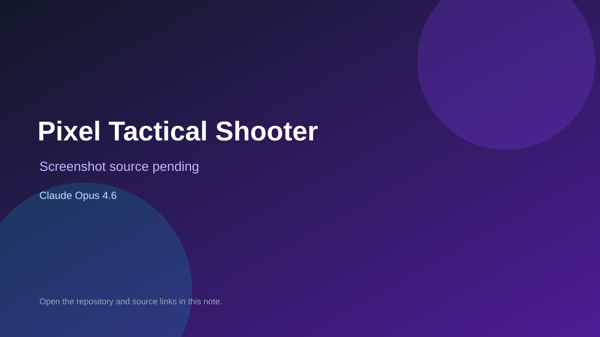

# Pixel Tactical Shooter

> Verified game note.

## At a glance

- **Score:** 8.8/10
- **Model:** Claude Opus 4.6
- **Technology:** TypeScript, Three.js, WebGL, Browser
- **Verified:** 2026-09-10
- **Repository:** [https://github.com/Vadaski/pixel-tactical-shooter](https://github.com/Vadaski/pixel-tactical-shooter)
- **Evidence:** [direct model evidence](https://github.com/Vadaski/pixel-tactical-shooter/commit/f7a7f2fac1f02aa457dc81d7114c16492723a838)
- **Live demo:** [open demo](https://vadaski.github.io/pixel-tactical-shooter/)

## Screenshots

No screenshot source is recorded yet. Keep the placeholder until a repository, awesome list, or creator source provides an image.

## Model attribution

Open the evidence link above. Evidence grade: **direct model evidence**.

## Source description

The repository README identifies a browser-playable 3D tactical shooter built with Three.js, with two playable maps, bots, weapons, objectives and deterministic gameplay tests. The initial game commit explicitly describes the game and includes a Co-Authored-By: Claude Opus 4.6 trailer. GitHub Pages is enabled at the recorded live URL.

### Gameplay source

- [https://github.com/Vadaski/pixel-tactical-shooter/blob/main/index.html](https://github.com/Vadaski/pixel-tactical-shooter/blob/main/index.html)
- [https://github.com/Vadaski/pixel-tactical-shooter/commit/f7a7f2fac1f02aa457dc81d7114c16492723a838](https://github.com/Vadaski/pixel-tactical-shooter/commit/f7a7f2fac1f02aa457dc81d7114c16492723a838)

## Verification notes

- **Status:** verified_source_and_live_demo
- **Counted units:** 1
- **Discovery:** GitHub code search for Claude Opus 4.6 game attribution; https://github.com/Vadaski/pixel-tactical-shooter

[Back to the awesome list](../../README.md)
