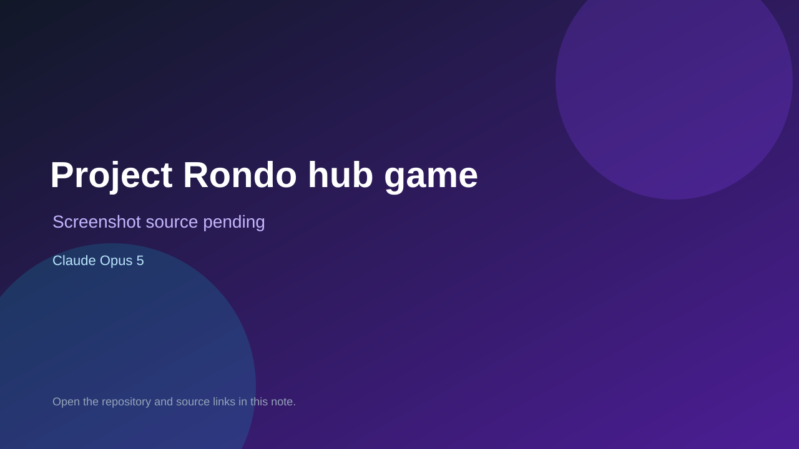

# Project Rondo hub game

> Verified game note.

## At a glance

- **Score:** 8.9/10
- **Model:** Claude Opus 5
- **Technology:** Svelte 5, TypeScript, Babylon.js, Havok physics, Vite, Tauri v2, Browser and desktop
- **Verified:** 2026-09-10
- **Repository:** [https://github.com/YuutaTsubasa/ProjectRondo](https://github.com/YuutaTsubasa/ProjectRondo)
- **Evidence:** [direct model evidence](https://github.com/YuutaTsubasa/ProjectRondo/commit/1d932dcfdc376a23d390a4fc99b4bd9455e17b89)

## Screenshots

No screenshot source is recorded yet. Keep the placeholder until a repository, awesome list, or creator source provides an image.

## Model attribution

Open the evidence link above. Evidence grade: **direct model evidence**.

## Source description

The README describes a Svelte/TypeScript/Babylon.js game migrated from a Godot prototype. The currently playable unit is a third-person 3D hub: a knight walks in a populated grassland with trees, procedural skydome, lighting, shadows, scatter, Havok collision, Idle/Walk animation, mouse-look, jump, audio, dialogue intro and a pure domain movement loop. The repository also includes source and tests for the hub, Babylon presentation, dialogue, audio and desktop packaging. Do not count the future Sonic-style levels or puzzle games promised by the hub description. The history contains exact Claude Opus 5 gameplay/presentation commits. Count only the current hub game once.

### Gameplay source

- [https://github.com/YuutaTsubasa/ProjectRondo/blob/main/README.md](https://github.com/YuutaTsubasa/ProjectRondo/blob/main/README.md)
- [https://github.com/YuutaTsubasa/ProjectRondo/blob/main/package.json](https://github.com/YuutaTsubasa/ProjectRondo/blob/main/package.json)
- [https://github.com/YuutaTsubasa/ProjectRondo/tree/main/src/presentation/babylon](https://github.com/YuutaTsubasa/ProjectRondo/tree/main/src/presentation/babylon)
- [https://github.com/YuutaTsubasa/ProjectRondo/blob/main/src/presentation/babylon/hubScene.ts](https://github.com/YuutaTsubasa/ProjectRondo/blob/main/src/presentation/babylon/hubScene.ts)
- [https://github.com/YuutaTsubasa/ProjectRondo/tree/main/src/domain](https://github.com/YuutaTsubasa/ProjectRondo/tree/main/src/domain)
- [https://github.com/YuutaTsubasa/ProjectRondo/tree/main/tests](https://github.com/YuutaTsubasa/ProjectRondo/tree/main/tests)
- [https://github.com/YuutaTsubasa/ProjectRondo/commit/1d932dcfdc376a23d390a4fc99b4bd9455e17b89](https://github.com/YuutaTsubasa/ProjectRondo/commit/1d932dcfdc376a23d390a4fc99b4bd9455e17b89)

## Verification notes

- **Status:** verified_source
- **Counted units:** 1
- **Discovery:** GitHub code search for Godot game Co-Authored-By Claude Opus 5; https://github.com/YuutaTsubasa/ProjectRondo

[Back to the awesome list](../../README.md)
