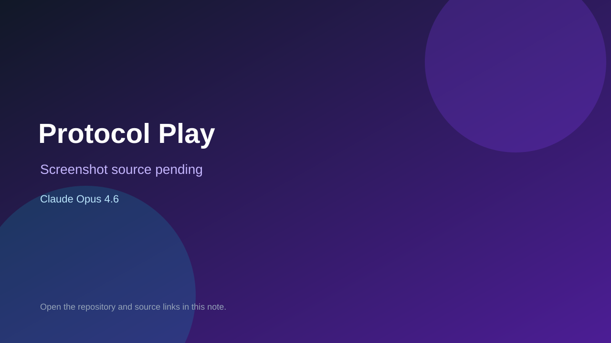

# Protocol Play

> Verified game note.

## At a glance

- **Score:** 8.8/10
- **Model:** Claude Opus 4.6
- **Technology:** Bevy 0.18, Rust, Native desktop, WebAssembly
- **Verified:** 2026-09-10
- **Repository:** [https://github.com/jjgarcianorway/protocol-play](https://github.com/jjgarcianorway/protocol-play)
- **Evidence:** [direct model evidence](https://github.com/jjgarcianorway/protocol-play/commit/8d0ac48b2d3ca6f903b6eadf4b872ecb181c5fec)

## Screenshots

No screenshot source is recorded yet. Keep the placeholder until a repository, awesome list, or creator source provides an image.

## Model attribution

Open the evidence link above. Evidence grade: **direct model evidence**.

## Source description

The README describes a tile puzzle game with 149 levels across 13 chapters, colored bots, turns, arrows, teleports, bouncers, painters, switches, doors, speed control, path sharing and an AI narrator. Source includes board, bots, puzzle scenes, levels, game state and tests. The cited commit page shows a direct Claude Opus 4.6 trailer.

### Gameplay source

- [https://github.com/jjgarcianorway/protocol-play/blob/main/README.md](https://github.com/jjgarcianorway/protocol-play/blob/main/README.md)
- [https://github.com/jjgarcianorway/protocol-play/blob/main/src/board.rs](https://github.com/jjgarcianorway/protocol-play/blob/main/src/board.rs)
- [https://github.com/jjgarcianorway/protocol-play/blob/main/src/bot_puzzle_scene.rs](https://github.com/jjgarcianorway/protocol-play/blob/main/src/bot_puzzle_scene.rs)
- [https://github.com/jjgarcianorway/protocol-play/blob/main/src/game.rs](https://github.com/jjgarcianorway/protocol-play/blob/main/src/game.rs)
- [https://github.com/jjgarcianorway/protocol-play/commit/8d0ac48b2d3ca6f903b6eadf4b872ecb181c5fec](https://github.com/jjgarcianorway/protocol-play/commit/8d0ac48b2d3ca6f903b6eadf4b872ecb181c5fec)

## Verification notes

- **Status:** verified_source
- **Counted units:** 1
- **Discovery:** GitHub commit search for Bevy game Co-Authored-By Claude Opus; https://github.com/jjgarcianorway/protocol-play

[Back to the awesome list](../../README.md)
