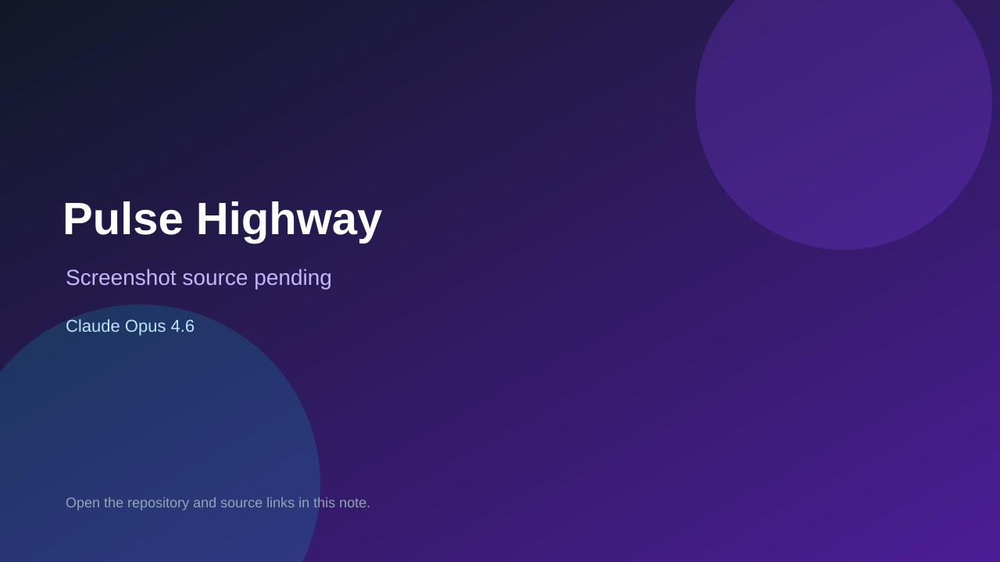

# Pulse Highway

> Verified game note.

## At a glance

- **Score:** 8.5/10
- **Model:** Claude Opus 4.6
- **Technology:** Unity, C#, Universal Render Pipeline, Native
- **Verified:** 2026-09-10
- **Repository:** [https://github.com/bccdon/musicGameUnity](https://github.com/bccdon/musicGameUnity)
- **Evidence:** [direct model evidence](https://github.com/bccdon/musicGameUnity/commit/f0e50ae4269d8815635a101dda8b801ab5a93d61)

## Screenshots

No screenshot source is recorded yet. Keep the placeholder until a repository, awesome list, or creator source provides an image.

## Model attribution

Open the evidence link above. Evidence grade: **direct model evidence**.

## Source description

The cited initial commit is titled Pulse Highway Unity rhythm game and describes a 24-level campaign, procedural audio and five-lane gameplay. It contains Unity bootstrap scenes, editor/build scripts and game source. The commit page shows a direct Co-Authored-By: Claude Opus 4.6 trailer.

### Gameplay source

- [https://github.com/bccdon/musicGameUnity/tree/main/Assets/Scenes](https://github.com/bccdon/musicGameUnity/tree/main/Assets/Scenes)
- [https://github.com/bccdon/musicGameUnity/tree/main/Assets/Scripts](https://github.com/bccdon/musicGameUnity/tree/main/Assets/Scripts)
- [https://github.com/bccdon/musicGameUnity/commit/f0e50ae4269d8815635a101dda8b801ab5a93d61](https://github.com/bccdon/musicGameUnity/commit/f0e50ae4269d8815635a101dda8b801ab5a93d61)

## Verification notes

- **Status:** verified_source
- **Counted units:** 1
- **Discovery:** GitHub commit search for Unity game Co-Authored-By Claude Opus 4.6; https://github.com/bccdon/musicGameUnity

[Back to the awesome list](../../README.md)
