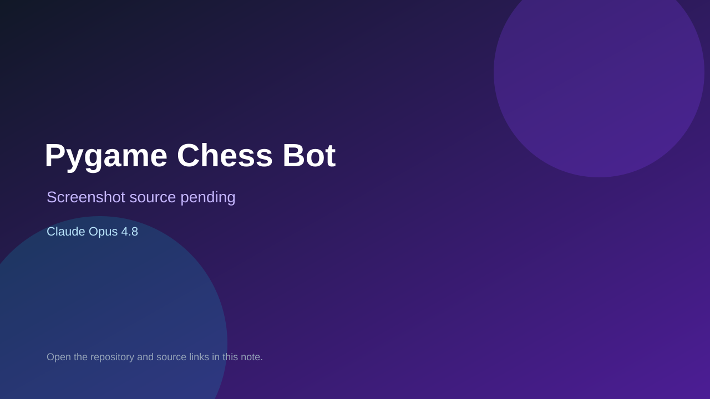

# Pygame Chess Bot

> Verified game note.

## At a glance

- **Score:** 7.9/10
- **Model:** Claude Opus 4.8
- **Technology:** Pygame, Python, Native desktop
- **Verified:** 2026-09-10
- **Repository:** [https://github.com/Goodest-ai/chess-bot](https://github.com/Goodest-ai/chess-bot)
- **Evidence:** [direct model evidence](https://github.com/Goodest-ai/chess-bot/commit/e04fcb2bb6865e7f2c395ab5dadf7e4bed2d2931)

## Screenshots

No screenshot source is recorded yet. Keep the placeholder until a repository, awesome list, or creator source provides an image.

## Model attribution

Open the evidence link above. Evidence grade: **direct model evidence**.

## Source description

The initial commit is titled pygame chess bot and contains ChessMain UI, ChessEngine move generation and piece image assets. The commit page shows a direct Claude Opus 4.8 trailer.

### Gameplay source

- [https://github.com/Goodest-ai/chess-bot/blob/main/Chess/ChessMain.py](https://github.com/Goodest-ai/chess-bot/blob/main/Chess/ChessMain.py)
- [https://github.com/Goodest-ai/chess-bot/blob/main/Chess/ChessEngine.py](https://github.com/Goodest-ai/chess-bot/blob/main/Chess/ChessEngine.py)
- [https://github.com/Goodest-ai/chess-bot/commit/e04fcb2bb6865e7f2c395ab5dadf7e4bed2d2931](https://github.com/Goodest-ai/chess-bot/commit/e04fcb2bb6865e7f2c395ab5dadf7e4bed2d2931)

## Verification notes

- **Status:** verified_source
- **Counted units:** 1
- **Discovery:** GitHub commit search for Pygame game Co-Authored-By Claude Opus; https://github.com/Goodest-ai/chess-bot

[Back to the awesome list](../../README.md)
