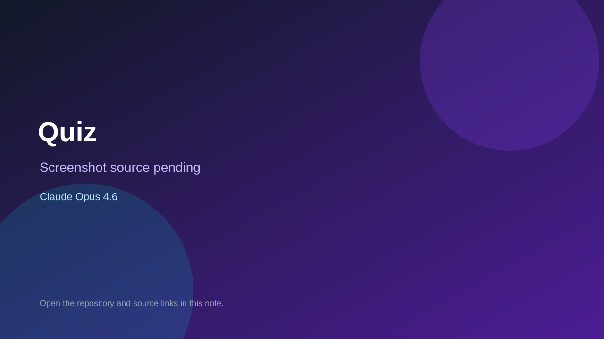

# Quiz

> Verified game note.

## At a glance

- **Score:** 8.2/10
- **Model:** Claude Opus 4.6
- **Technology:** PHP, Laravel, Livewire, WebSockets, Browser
- **Verified:** 2026-09-10
- **Repository:** [https://github.com/cmarangon/quiz](https://github.com/cmarangon/quiz)
- **Evidence:** [direct model evidence](https://github.com/cmarangon/quiz/commit/f3e379f86da452d7ead719213051e093bce67c78)

## Screenshots

No screenshot source is recorded yet. Keep the placeholder until a repository, awesome list, or creator source provides an image.

## Model attribution

Open the evidence link above. Evidence grade: **direct model evidence**.

## Source description

The README identifies a real Kahoot-style party trivia game with host, player and spectator screens, room codes, question types, scoring and real-time Reverb events. The cited implementation commit adds the quiz game, database models and session state machine and carries Co-Authored-By: Claude Opus 4.6 trailers. Count it as source-verified because no stable public deployment was found.

### Gameplay source

- [https://github.com/cmarangon/quiz/tree/develop/app](https://github.com/cmarangon/quiz/tree/develop/app)
- [https://github.com/cmarangon/quiz/commit/f3e379f86da452d7ead719213051e093bce67c78](https://github.com/cmarangon/quiz/commit/f3e379f86da452d7ead719213051e093bce67c78)

## Verification notes

- **Status:** verified_source
- **Counted units:** 1
- **Discovery:** GitHub commit search for game Co-Authored-By Claude Opus 4.6; https://github.com/cmarangon/quiz

[Back to the awesome list](../../README.md)
