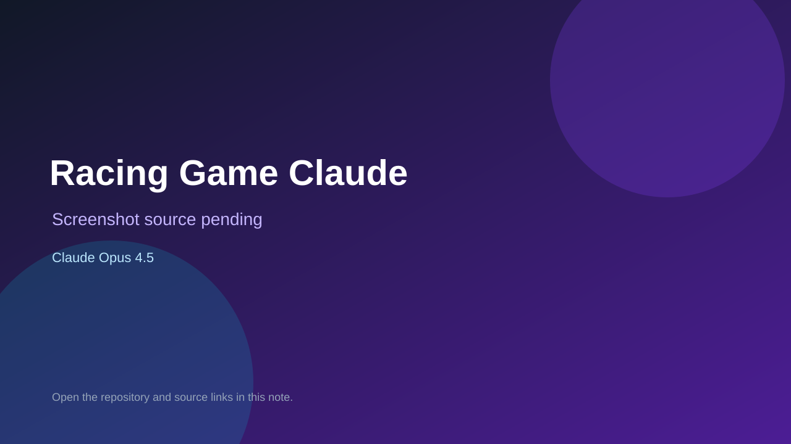

# Racing Game Claude

> Verified game note.

## At a glance

- **Score:** 8.0/10
- **Model:** Claude Opus 4.5
- **Technology:** Pygame, Python, Native desktop
- **Verified:** 2026-09-10
- **Repository:** [https://github.com/srijan-vaddadi/Racing-Game-Claude](https://github.com/srijan-vaddadi/Racing-Game-Claude)
- **Evidence:** [direct model evidence](https://github.com/srijan-vaddadi/Racing-Game-Claude/commit/e18e0561b261f88a5d730750ea8a44e91d8c2ade)

## Screenshots

No screenshot source is recorded yet. Keep the placeholder until a repository, awesome list, or creator source provides an image.

## Model attribution

Open the evidence link above. Evidence grade: **direct model evidence**.

## Source description

The repository contains a Pygame racing game entrypoint with a display/game loop, player car controls, selectable car types and colors, NPC cars, track/road checks, collisions, lap/race state, menu UI and race persistence. The initial setup commit explicitly adds a Pygame racing game and includes a direct Claude Opus 4.5 trailer. The default branch is master; current source links are verified there.

### Gameplay source

- [https://github.com/srijan-vaddadi/Racing-Game-Claude/blob/master/main.py](https://github.com/srijan-vaddadi/Racing-Game-Claude/blob/master/main.py)
- [https://github.com/srijan-vaddadi/Racing-Game-Claude/blob/master/src/car.py](https://github.com/srijan-vaddadi/Racing-Game-Claude/blob/master/src/car.py)
- [https://github.com/srijan-vaddadi/Racing-Game-Claude/blob/master/src/npc_car.py](https://github.com/srijan-vaddadi/Racing-Game-Claude/blob/master/src/npc_car.py)
- [https://github.com/srijan-vaddadi/Racing-Game-Claude/blob/master/src/track.py](https://github.com/srijan-vaddadi/Racing-Game-Claude/blob/master/src/track.py)
- [https://github.com/srijan-vaddadi/Racing-Game-Claude/commit/e18e0561b261f88a5d730750ea8a44e91d8c2ade](https://github.com/srijan-vaddadi/Racing-Game-Claude/commit/e18e0561b261f88a5d730750ea8a44e91d8c2ade)

## Verification notes

- **Status:** verified_source
- **Counted units:** 1
- **Discovery:** GitHub commit search for pygame game Co-Authored-By Claude Opus; https://github.com/srijan-vaddadi/Racing-Game-Claude

[Back to the awesome list](../../README.md)
