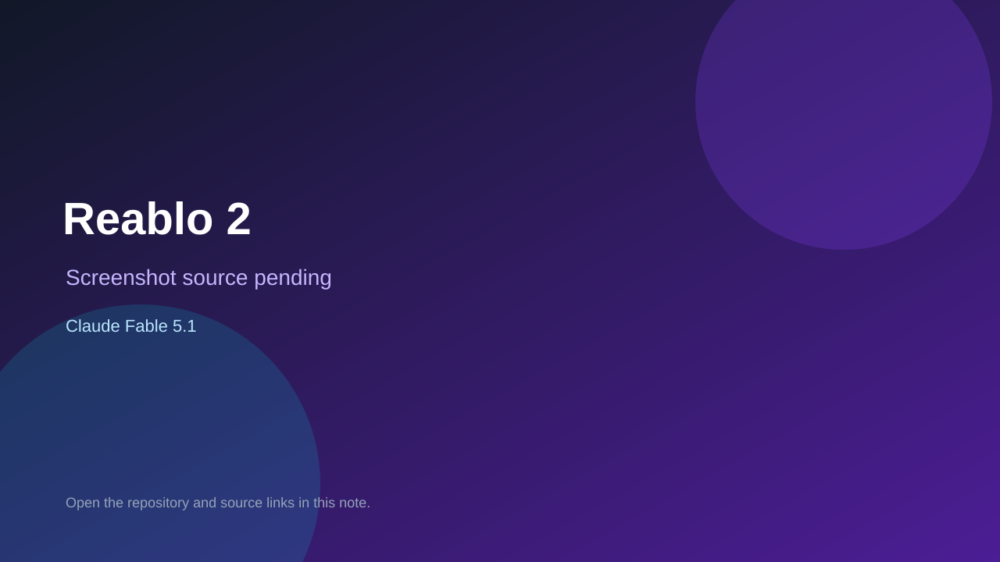

# Reablo 2

> Verified game note.

## At a glance

- **Score:** 8.0/10
- **Model:** Claude Fable 5.1
- **Technology:** TypeScript, Canvas 2D, Bun, WebSocket
- **Verified:** 2026-09-09
- **Repository:** [https://github.com/oeo/reablo-2](https://github.com/oeo/reablo-2)
- **Evidence:** [direct model evidence](https://github.com/oeo/reablo-2)

## Screenshots

No screenshot source is recorded yet. Keep the placeholder until a repository, awesome list, or creator source provides an image.

## Model attribution

Open the evidence link above. Evidence grade: **direct model evidence**.

## Source description

Playable browser action RPG with accounts, characters, items, combat, co-op, tests, and explicit one-shot Claude Fable 5.1 history.

### Gameplay source

- [https://github.com/oeo/reablo-2](https://github.com/oeo/reablo-2)

## Verification notes

- **Status:** verified
- **Counted units:** 1
- **Discovery:** https://github.com/oeo/reablo-2

[Back to the awesome list](../../README.md)
