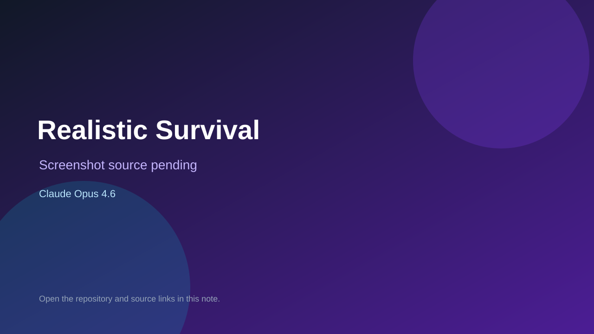

# Realistic Survival

> Verified game note.

## At a glance

- **Score:** 8.1/10
- **Model:** Claude Opus 4.6
- **Technology:** HTML, JavaScript, Canvas, Browser
- **Verified:** 2026-09-10
- **Repository:** [https://github.com/liuyixuan5678/offline-games](https://github.com/liuyixuan5678/offline-games)
- **Evidence:** [direct model evidence](https://github.com/liuyixuan5678/offline-games/commit/fad5695c1bcb8d739ba330a26e38de927813381e)

## Screenshots

No screenshot source is recorded yet. Keep the placeholder until a repository, awesome list, or creator source provides an image.

## Model attribution

Open the evidence link above. Evidence grade: **direct model evidence**.

## Source description

The repository README describes Realistic Survival as a top-down shooter with waves and upgradeable weapons. The cited commit adds a standalone realistic-survival/index.html with player controls, combat, enemies, progression and game-over/victory UI, and carries a Co-Authored-By: Claude Opus 4.6 trailer. Count only this explicitly attributed game, not the other unrelated offline games in the repository.

### Gameplay source

- [https://github.com/liuyixuan5678/offline-games/tree/main/realistic-survival](https://github.com/liuyixuan5678/offline-games/tree/main/realistic-survival)
- [https://github.com/liuyixuan5678/offline-games/commit/fad5695c1bcb8d739ba330a26e38de927813381e](https://github.com/liuyixuan5678/offline-games/commit/fad5695c1bcb8d739ba330a26e38de927813381e)

## Verification notes

- **Status:** verified_source
- **Counted units:** 1
- **Discovery:** GitHub commit search for game Co-Authored-By Claude Opus 4.6; https://github.com/liuyixuan5678/offline-games

[Back to the awesome list](../../README.md)
